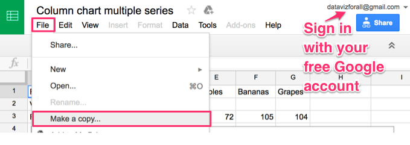
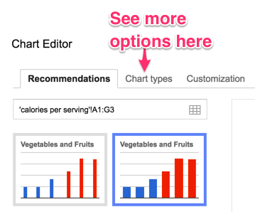

# Column and Bar Charts with Google Sheets
*By [Jack Dougherty](../../introduction/who.md), last updated February 12, 2017*

Follow these tutorials to create different types of column and bar charts with [Google Sheets](http://sheets.google.com)
- Grouped
- Separated
- Stacked
- Histograms

## Grouped Column and Bar Charts
Best to compare categories of data, side by side. Use vertical columns or horizontal bars (with more space for long labels).

**Try it:** This grouped column chart shows differences in obesity between men and women in each age bracket. Float your cursor over columns to view data details.

<iframe width="600" height="371" seamless frameborder="0" scrolling="no" src="https://docs.google.com/spreadsheets/d/1ltA9siijVSDkTE3fzB3UaWHO7dotBIrGH4R9wI_Qyqw/pubchart?oid=787918829&amp;format=interactive"></iframe><a href="https://docs.google.com/spreadsheets/d/1ltA9siijVSDkTE3fzB3UaWHO7dotBIrGH4R9wI_Qyqw/edit#gid=1017658845">View data from CDC and StateOfObesity.org</a>

**Tutorial:**
- Begin by opening this link in a new tab: [Google Sheet Column chart with grouped data template](https://docs.google.com/spreadsheets/d/1ltA9siijVSDkTE3fzB3UaWHO7dotBIrGH4R9wI_Qyqw/)
- Follow most of the same steps in first tutorial above.
- Format your data in a similar way as shown below. Each column is a data series, which displays as a separate color in the chart. 

- In the Chart Editor > Recommendations tab, choose your preferred Column chart (or Bar chart if you prefer a horizontal orientation), or see more options in Chart Types tab.

## Separated Column and Bar Charts
Best to compare categories of data, in separate series rather than side-by-side. Use vertical columns or horizontal bars (with more space for long labels).  

**Try it:** This separated bar chart shows calorie counts of fast food items, separated by restaurant chains. The horizontal bar offers more space for longer labels. Float your cursor over bars to explore data details.

<iframe width="700" height="432" seamless frameborder="0" scrolling="no" src="https://docs.google.com/spreadsheets/d/1LGUYaVLoRcOiB8KcXb3Rn7LRj0exnUQYOy58LrkGPAk/pubchart?oid=1270431574&amp;format=interactive"></iframe> <a href="https://docs.google.com/spreadsheets/d/1LGUYaVLoRcOiB8KcXb3Rn7LRj0exnUQYOy58LrkGPAk/edit#gid=956322126">View data from Starbucks and McDonalds</a>

** Tutorial MERGE WITH BELOW: **
- Begin by opening this link in a new tab: [Google Sheet Column chart with separated data template](https://docs.google.com/spreadsheets/d/1_bzUNULtAgGesP-J9gke2xEn4jdaqfMb1d24ZuaAkzA/)
- Log in or [create your free Google account](http://sheets.google.com)
- Select File > Make a Copy to create your own version in your Google Drive. 

- To remove the current chart from your copy, select the chart in the spreadsheet and press the delete button on your keyboard.
- Format your data in a similar way as shown below. Each row is a data series, which displays as a separate color in the chart. 

- Use your cursor to select only the data you wish to chart, then select Insert > Chart. 

- In the Chart Editor > Recommendations tab, choose your preferred Column chart, or see more options in Chart Types tab. Press the Insert button. 

- To customize title, labels, and more, click the editing controls in the upper-right corner. 

- To make your data public, select the blue Share button > Advanced, then Change from Private to Public On the Web, with Anyone Can View. 

- To embed your chart in another website, click the chart editing controls in the upper-right corner, select Publish Chart, select Embed, and press the Publish button. Copy the iframe code and read the [Embed on Your Web](http://www.datavizforall.org/embed/) chapter.

**Tutorial: MERGE WITH ABOVE**
- Begin by opening this link in a new tab: [Google Sheet Bar chart with separated data template](https://docs.google.com/spreadsheets/d/1LGUYaVLoRcOiB8KcXb3Rn7LRj0exnUQYOy58LrkGPAk/)
- Follow most of the same steps in the first tutorial above.
- Format your data in a similar way as shown below. Each column is a data series, which displays as a separate color in the chart. 

- In  the Chart Editor > Recommendations tab, choose your preferred Bar chart, or see more options in Chart Types tab.

## Stacked Column and Bar Charts
Best to compare differences between sub-categories of data. Use vertical columns or horizontal bars (with more space for long labels).

**Try it:** This stacked column chart compares the percentage of overweight residents across nations. Float your cursor over columns to view data details.

<iframe width="600" height="371" seamless frameborder="0" scrolling="no" src="https://docs.google.com/spreadsheets/d/1WS11EK33JCmvCRzSDh9UpP6R7Z2sHglF7ve5iJL6eZk/pubchart?oid=307057605&amp;format=interactive"></iframe><a href="https://docs.google.com/spreadsheets/d/1WS11EK33JCmvCRzSDh9UpP6R7Z2sHglF7ve5iJL6eZk/edit#gid=735710691">View data from WHO and CDC</a>

**Tutorial:**
- Begin by opening this link in a new tab: [Google Sheets Stacked column chart template
- Follow most of the same steps in first tutorial above.
- Format your data in a similar way as shown below. Each column is a data series, which displays as a separate color in the chart. 

- In the Chart Editor > Recommendations tab, choose Stacked column chart (or Stacked bar chart if you prefer a horizontal orientation), or see more options in Chart Types tab.

## Histograms
Best to show the distribution of raw data, with number of values in each bucket. Typically displayed in vertical columns.

**Try it**   to come*

**Tutorial:**  to come *

- Format data into two columns
  - data labels in the first column
  - numeric values in second column
