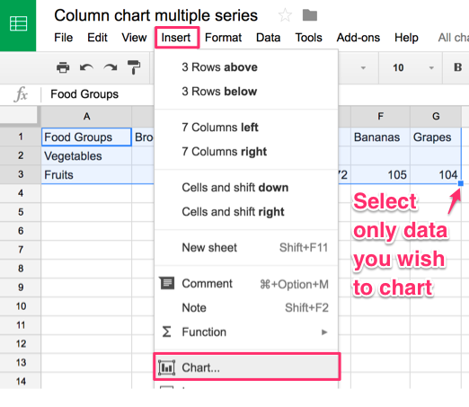
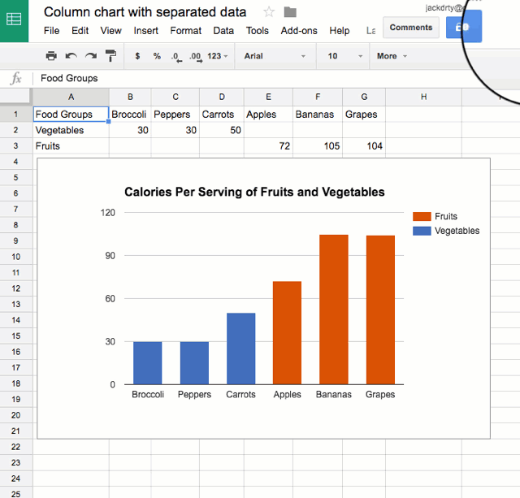
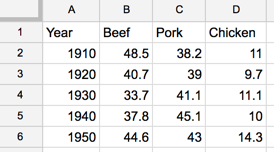
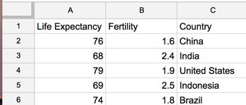
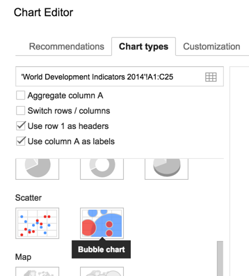

# Charts with Google Sheets
*By [Jack Dougherty](../../introduction/who.md), last updated January 22, 2017*

Use Google Sheets (http://sheets.google.com) to create common types of interactive charts that can be embedded in your website. In the tutorials below, you will learn how to make:
- [Column chart with separated data](#column-chart-with-separated-data)
- [Bar chart with separated data](#bar-chart-with-separated-data)
- [Column or bar chart with grouped data](#column-or-bar-chart-with-grouped-data)
- [Stacked column or stacked bar chart](#stacked-column-or stacked-bar-chart)
- [Line chart](#line-chart)
- [Scatter chart](#scatter-chart)
- [Bubble chart with 3 columns](#bubble-chart-with-3-columns)
- [Bubble chart with 5 columns](#bubble-chart-with-5-columns)
- and [learn about more chart types](https://support.google.com/docs/answer/190718)

## Tool Review
- Pros:
  - Free and easy-to-learn tool on the collaborative Google Drive platform.
  - Edit, share, and publish interactive charts from your data, all in one spreadsheet.
- Cons:
  - Limited control over chart appearance.
  - No automatic option to cite or link source data inside the chart.
  - Scatter charts do not correctly display data labels in tooltips.
  - Bubble charts cannot display uniformly small bubble sizes.
  - For more powerful tools that require more skills, see tutorials in this book on [Tableau Public](../scatter-chart-tableau/) and [Highcharts](../../highcharts/).

## Column chart with separated data
Best to show differences between categories, with colors separating each data series. In the example below, the first data series (vegetables) is blue, and the second series (fruits) is red.

Try it: Float your cursor over columns to explore data details.

<iframe width="600" height="371" seamless frameborder="0" scrolling="no" src="https://docs.google.com/spreadsheets/d/1_bzUNULtAgGesP-J9gke2xEn4jdaqfMb1d24ZuaAkzA/pubchart?oid=355867442&amp;format=interactive"></iframe> <a href="https://docs.google.com/spreadsheets/d/1_bzUNULtAgGesP-J9gke2xEn4jdaqfMb1d24ZuaAkzA/edit#gid=1527457280">View data from USDA</a>

### Tutorial:
- Begin by opening this link in a new tab: [Google Sheet Column chart with separated data template](https://docs.google.com/spreadsheets/d/1_bzUNULtAgGesP-J9gke2xEn4jdaqfMb1d24ZuaAkzA/)
- Log in or [create your free Google account](http://sheets.google.com)
- Select File > Make a Copy to create your own version in your Google Drive. 

- To remove the current chart from your copy, select the chart in the spreadsheet and press the delete button on your keyboard.
- Format your data in a similar way as shown below. Each row is a data series, which displays as a separate color in the chart. 

- Use your cursor to select only the data you wish to chart, then select Insert > Chart. 

- In the Chart Editor > Recommendations tab, choose your preferred Column chart, or see more options in Chart Types tab. Press the Insert button. 

- To customize title, labels, and more, click the editing controls in the upper-right corner. 

- To make your data public, select the blue Share button > Advanced, then Change from Private to Public On the Web, with Anyone Can View. 

- To embed your chart in another website, click the chart editing controls in the upper-right corner, select Publish Chart, select Embed, and press the Publish button. Copy the iframe code and read the [Embed on Your Web](http://www.datavizforall.org/embed/) chapter.

## Bar chart with separated data
Best to show differences between categories, with colors separating each data series, especially when long labels require more space. In the example below, the bar chart works better than a column chart for the long labels in the first data series (Starbucks drink items).

Try it: Float your cursor over bars to explore data details.

<iframe width="700" height="432" seamless frameborder="0" scrolling="no" src="https://docs.google.com/spreadsheets/d/1LGUYaVLoRcOiB8KcXb3Rn7LRj0exnUQYOy58LrkGPAk/pubchart?oid=1270431574&amp;format=interactive"></iframe> <a href="https://docs.google.com/spreadsheets/d/1LGUYaVLoRcOiB8KcXb3Rn7LRj0exnUQYOy58LrkGPAk/edit#gid=956322126">View data from Starbucks and McDonalds</a>

### Tutorial:
- Begin by opening this link in a new tab: [Google Sheet Bar chart with separated data template](https://docs.google.com/spreadsheets/d/1LGUYaVLoRcOiB8KcXb3Rn7LRj0exnUQYOy58LrkGPAk/)
- Follow most of the same steps in the first tutorial above.
- Format your data in a similar way as shown below. Each column is a data series, which displays as a separate color in the chart. 

- In  the Chart Editor > Recommendations tab, choose your preferred Bar chart, or see more options in Chart Types tab.

## Column or bar chart with grouped data
Best to show differences between categories, where different data series are grouped together to show contrast, rather than separated as shown above. In the example below, men and women are different data series, but they are placed side-by-side to highlights differences in each age bracket.

Try it: Float your cursor over columns to explore data details.

<iframe width="600" height="371" seamless frameborder="0" scrolling="no" src="https://docs.google.com/spreadsheets/d/1ltA9siijVSDkTE3fzB3UaWHO7dotBIrGH4R9wI_Qyqw/pubchart?oid=787918829&amp;format=interactive"></iframe><a href="https://docs.google.com/spreadsheets/d/1ltA9siijVSDkTE3fzB3UaWHO7dotBIrGH4R9wI_Qyqw/edit#gid=1017658845">View data from CDC and StateOfObesity.org</a>

### Tutorial:
- Begin by opening this link in a new tab: [Google Sheet Column chart with grouped data template](https://docs.google.com/spreadsheets/d/1ltA9siijVSDkTE3fzB3UaWHO7dotBIrGH4R9wI_Qyqw/)
- Follow most of the same steps in first tutorial above.
- Format your data in a similar way as shown below. Each column is a data series, which displays as a separate color in the chart. 

- In the Chart Editor > Recommendations tab, choose your preferred Column chart (or Bar chart if you prefer a horizontal orientation), or see more options in Chart Types tab.

## Stacked column or stacked bar chart
Best to show differences between sub-categories of data. In the example below, when stacked columns are placed side-by-side, they contrast the percentages of overweight residents in each nation (displayed in blue). Use stacked column or bar charts instead of pie charts, since readers can interpret rectangle sizes more accurately than pie slices.

Try it: Float your cursor over columns to explore data details.

<iframe width="600" height="371" seamless frameborder="0" scrolling="no" src="https://docs.google.com/spreadsheets/d/1WS11EK33JCmvCRzSDh9UpP6R7Z2sHglF7ve5iJL6eZk/pubchart?oid=307057605&amp;format=interactive"></iframe><a href="https://docs.google.com/spreadsheets/d/1WS11EK33JCmvCRzSDh9UpP6R7Z2sHglF7ve5iJL6eZk/edit#gid=735710691">View data from WHO and CDC</a>

### Tutorial:
- Begin by opening this link in a new tab: [Google Sheets Stacked column chart template
- Follow most of the same steps in first tutorial above.
- Format your data in a similar way as shown below. Each column is a data series, which displays as a separate color in the chart. 

- In the Chart Editor > Recommendations tab, choose Stacked column chart (or Stacked bar chart if you prefer a horizontal orientation), or see more options in Chart Types tab.

## Line chart
Best to show changes in continuous data (such as measurements over time). In the example below, the data series for chicken (shown in orange) rises steadily and surpasses the other data series for beef (red) and port (blue).

Try it: Float your cursor over lines to explore data details.

<iframe width="600" height="371" seamless frameborder="0" scrolling="no" src="https://docs.google.com/spreadsheets/d/1wkWxxZ2-N5hqkcp7in8bxwdEcT1-XMnt1A8qUXxUSjw/pubchart?oid=2073830845&amp;format=interactive"></iframe><a href="https://docs.google.com/spreadsheets/d/1wkWxxZ2-N5hqkcp7in8bxwdEcT1-XMnt1A8qUXxUSjw/edit#gid=894957893">View source data from USDA</a>

### Tutorial
- Begin by opening this link in a new tab: [Google Sheet Line chart template](https://docs.google.com/spreadsheets/d/1wkWxxZ2-N5hqkcp7in8bxwdEcT1-XMnt1A8qUXxUSjw/)
- Follow most of the same steps in first tutorial above.
- Format your data in a similar way as shown below. Each column is a data series, which displays as a separate color in the chart. 

- In the Chart Editor > Recommendations tab, choose Line chart, or see more options in Chart Types tab.

## Scatter chart
Best to show relationships between two series of data. Also called an XY chart. In the example below, each point represents a coordinate value plotted along the horizontal x-axis (life expectancy) and the vertical y-axis (fertility). This scatter chart reveals a downward slope: nations with lower fertility also tend to have higher life expectancy. But remember that a correlation between these data does not necessarily prove causation.  

Try it: Float your cursor over points to explore data details. Unfortunately, the Google Sheet scatter chart only displays the country name as a static label (which are crowded together), rather than in an interactive tooltip. See alternative tools below.

<iframe width="626" height="387" seamless frameborder="0" scrolling="no" src="https://docs.google.com/spreadsheets/d/1LJCj3RaVgaQsAZriV_JDQhBrIBSvnH_N1LBCkZK1bqs/pubchart?oid=386475448&amp;format=interactive"></iframe><a href="https://docs.google.com/spreadsheets/d/1LJCj3RaVgaQsAZriV_JDQhBrIBSvnH_N1LBCkZK1bqs/edit#gid=562477420">View source data from World Bank</a>

### Tutorial
- Begin by opening this link in a new tab: [Google Sheets Scatter chart with static data labels](https://docs.google.com/spreadsheets/d/1LJCj3RaVgaQsAZriV_JDQhBrIBSvnH_N1LBCkZK1bqs/)
- Follow most of the same steps in first tutorial above.
- Format your data in a similar way as shown below. The first column (life expectancy) is the x-axis data series, and the second column  (fertility) is the y-axis data series. The third column consists of data labels (names of countries). 

- In the Chart Editor > Recommendations tab, choose Scatter chart, or see more options in Chart Types tab.
- To display static labels for each point, click the upper-right charter corner for Advanced Editing tools > Customization tab, the scroll down to Series > Data labels > Custom, and press Update.

- Since the Google Sheets scatter chart is not ideal, consider using the 3-column bubble chart below, or the [Scatter Chart with Tableau Public tutorial](../scatter-chart-tableau-public/) in this book.

## Bubble chart with 3 columns
Best to show the relationship between two data series, very similar to the scatter chart above. The example below shows the same data as above on fertility and life expectancy, and floating the cursor over each bubbles reveals a tooltip with the country name and the two data points.

Try it: Float your cursor over bubbles to explore data details.

<iframe width="600" height="371" seamless frameborder="0" scrolling="no" src="https://docs.google.com/spreadsheets/d/1CL7joH_3wvMYo9HIiSuFP0Ykv_Nl5DK6DYYcd3_gFnU/pubchart?oid=2105121864&amp;format=interactive"></iframe><a href="https://docs.google.com/spreadsheets/d/1CL7joH_3wvMYo9HIiSuFP0Ykv_Nl5DK6DYYcd3_gFnU/edit#gid=1602534273">View source data from World Bank</a>

### Tutorial
- Begin by opening this link a new tab: [Google Sheets Bubble chart with 3 columns template](https://docs.google.com/spreadsheets/d/1CL7joH_3wvMYo9HIiSuFP0Ykv_Nl5DK6DYYcd3_gFnU/)
- Format your data in a similar way as shown below, with three columns in this order:
  - A: label for each bubble
  - B: numeric data on horizontal x-axis
  - C: numeric data on vertical y-axis 

- Follow most of the same steps in the first tutorial above.
- In the Chart Editor, skip the Recommendation tab, select the Chart Types tab, then choose Bubble chart (near Scatter chart). 

- Labels will appear on each bubble by default. To hide labels initially, so that they appear only in the interactive tooltips when floating the cursor over data, customize your chart. Click the editing controls in the upper-right corner, scroll down to Series, and change Labels > Color > None. 

- Unfortunately, there is no easy way to reduce all bubbles to a uniformly smaller size. See the Google Sheets Bubble chart with 5 columns below, or create a [Scatter Chart with Tableau Public](../scatter-chart-with-tableau-public/) in this book.

### Bubble chart with 5 columns
Best to show the relationship between three or four data series. The example below shows fertility and life expectancy for a subset of the nations above, along with a data series for population (shown by bubble size) and region (shown by bubble color). Hovering the cursor over any data point reveals a tooltip that lists the country name and all four data points.

Try it: Float your cursor over bubbles to explore data details.

<iframe width="600" height="371" seamless frameborder="0" scrolling="no" src="https://docs.google.com/spreadsheets/d/1YgBWYm9nTGlCuyqSwU3SDb7xk-SMSPgjfYq5iLqL0nQ/pubchart?oid=200651442&amp;format=interactive"></iframe><a href="https://docs.google.com/spreadsheets/d/1YgBWYm9nTGlCuyqSwU3SDb7xk-SMSPgjfYq5iLqL0nQ/edit#gid=1182154897">View data from World Bank</a>

### Tutorial
- Begin by opening this link a new tab: [Google Sheets Bubble chart with 5 columns template](https://docs.google.com/spreadsheets/d/1YgBWYm9nTGlCuyqSwU3SDb7xk-SMSPgjfYq5iLqL0nQ/)
- Follow most of the same steps in the tutorials above.
- Format your data in a similar way as shown below, with 5 columns in this order:
  - A: label for each bubble
  - B: numeric data on horizontal x-axis
  - C: numeric data on vertical y-axis
  - D: text data to represent bubble color (each category will appear as a new color, or leave blank to display all as one color)  
  - E: numeric data to represent bubble size 
  
- Labels will appear on each bubble by default. To hide labels in the default display (and show them only in the interactive tooltips when floating the cursor over data), see the 3-column bubble chart tutorial above.

### Learn more
See additional chart types in this [Google Sheets help page](https://support.google.com/docs/answer/190718)
