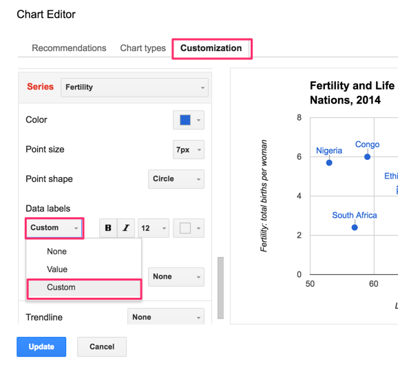
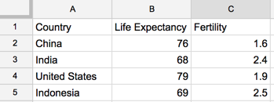
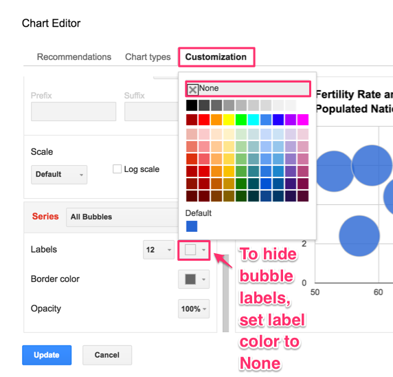

# Scatter and Bubble Charts with Google Sheets

Follow these tutorials to create different types scatter and bubble charts with [Google Sheets](http://sheets.google.com)

## Scatter chart
Best to show relationships between two series of data. Also called an XY chart, because each point represents a coordinate value plotted along the horizontal x-axis and the vertical y-axis.

**Try it:** This scatter chart reveals a downward slope: nations with lower fertility also tend to have higher life expectancy. But remember that a data correlation does not necessarily show causation. Float your cursor over points to view data details. However, the Google Sheet scatter chart only displays static labels for each country, rather than interactive tooltips. See alternative tools below.

<iframe width="626" height="387" seamless frameborder="0" scrolling="no" src="https://docs.google.com/spreadsheets/d/1LJCj3RaVgaQsAZriV_JDQhBrIBSvnH_N1LBCkZK1bqs/pubchart?oid=386475448&amp;format=interactive"></iframe><a href="https://docs.google.com/spreadsheets/d/1LJCj3RaVgaQsAZriV_JDQhBrIBSvnH_N1LBCkZK1bqs/edit#gid=562477420">View source data from World Bank</a>

**Tutorial:**
- Begin by opening this link in a new tab: [Google Sheets Scatter chart with static data labels](https://docs.google.com/spreadsheets/d/1LJCj3RaVgaQsAZriV_JDQhBrIBSvnH_N1LBCkZK1bqs/)
- Follow most of the same steps in first tutorial above.
- Format your data in a similar way as shown below. The first column (life expectancy) is the x-axis data series, and the second column  (fertility) is the y-axis data series. The third column consists of data labels (names of countries). 

- In the Chart Editor > Recommendations tab, choose Scatter chart, or see more options in Chart Types tab.
- To display static labels for each point, click the upper-right charter corner for Advanced Editing tools > Customization tab, the scroll down to Series > Data labels > Custom, and press Update.

- Since the Google Sheets scatter chart is not ideal, consider using the 3-column bubble chart below, or the [Scatter Chart with Tableau Public tutorial](../scatter-chart-tableau-public/) in this book.

## Bubble chart with 3 columns
Best to show the relationship between two series of data, similar to the scatter chart above, with labels in tooltips.

**Try it:** This bubble chart shows the same data as above on fertility and life expectancy. Float your cursor over each bubble to reveal a tooltip with the country name and the two data points.

<iframe width="600" height="371" seamless frameborder="0" scrolling="no" src="https://docs.google.com/spreadsheets/d/1CL7joH_3wvMYo9HIiSuFP0Ykv_Nl5DK6DYYcd3_gFnU/pubchart?oid=2105121864&amp;format=interactive"></iframe><a href="https://docs.google.com/spreadsheets/d/1CL7joH_3wvMYo9HIiSuFP0Ykv_Nl5DK6DYYcd3_gFnU/edit#gid=1602534273">View source data from World Bank</a>

**Tutorial:**
- Begin by opening this link a new tab: [Google Sheets Bubble chart with 3 columns template](https://docs.google.com/spreadsheets/d/1CL7joH_3wvMYo9HIiSuFP0Ykv_Nl5DK6DYYcd3_gFnU/)
- Format your data in a similar way as shown below, with three columns in this order:
  - A: label for each bubble
  - B: numeric data on horizontal x-axis
  - C: numeric data on vertical y-axis 

- Follow most of the same steps in the first tutorial above.
- In the Chart Editor, skip the Recommendation tab, select the Chart Types tab, then choose Bubble chart (near Scatter chart). 

- Labels will appear on each bubble by default. To hide labels initially, so that they appear only in the interactive tooltips when floating the cursor over data, customize your chart. Click the editing controls in the upper-right corner, scroll down to Series, and change Labels > Color > None. 

- Unfortunately, there is no easy way to reduce all bubbles to a uniformly smaller size. See the Google Sheets Bubble chart with 5 columns below, or create a [Scatter Chart with Tableau Public](../scatter-chart-with-tableau-public/) in this book.

## Bubble chart with 5 columns
Best to show the relationship between three or four series of data. Similar to a scatter chart, but with bubble size and color to represent additional variables.

**Try it:** This bubble chart shows fertility and life expectancy for a subset of the nations above, with population (shown by bubble size) and region (shown by bubble color). Float your cursor over bubbles to view data details.

<iframe width="600" height="371" seamless frameborder="0" scrolling="no" src="https://docs.google.com/spreadsheets/d/1YgBWYm9nTGlCuyqSwU3SDb7xk-SMSPgjfYq5iLqL0nQ/pubchart?oid=200651442&amp;format=interactive"></iframe><a href="https://docs.google.com/spreadsheets/d/1YgBWYm9nTGlCuyqSwU3SDb7xk-SMSPgjfYq5iLqL0nQ/edit#gid=1182154897">View data from World Bank</a>

** Tutorial **
- Begin by opening this link a new tab: [Google Sheets Bubble chart with 5 columns template](https://docs.google.com/spreadsheets/d/1YgBWYm9nTGlCuyqSwU3SDb7xk-SMSPgjfYq5iLqL0nQ/)
- Follow most of the same steps in the tutorials above.
- Format your data in a similar way as shown below, with 5 columns in this order:
  - A: label for each bubble
  - B: numeric data on horizontal x-axis
  - C: numeric data on vertical y-axis
  - D: text data to represent bubble color (each category will appear as a new color, or leave blank to display all as one color)  
  - E: numeric data to represent bubble size 
  
- Labels will appear on each bubble by default. To hide labels in the default display (and show them only in the interactive tooltips when floating the cursor over data), see the 3-column bubble chart tutorial above.

### Learn more
See additional chart types in this [Google Sheets help page](https://support.google.com/docs/answer/190718)
