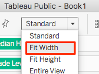

# Create an XY Scatter Chart with Tableau Public
*by [Jack Dougherty](../../introduction/who.md), last updated March 15, 2017*

An interactive scatter chart shows the relationship between two variables by displaying a series of XY coordinates. Readers can float their cursor over points to view specific details. The chart below, which illustrates the strong relationship between Connecticut school district income and test scores, was created with the free downloadable tool for Mac and Windows, Tableau Public http://public.tableau.com

## Try it

<iframe src="https://public.tableau.com/views/CTSchoolDistrictsbyIncomeandGradeLevels2009-13/Sheet1?:showVizHome=no&:embed=true" width="90%" height="500"></iframe>

## Video with step-by-step tutorial

70RKjT91cjs

1) Read the [Tableau Public tool review](../tableau-public) in this book, then download and install the free application on a Mac or Windows computer from http://public.tableau.com. Requires a free account.

2a) Right-click this link to Save this Excel file to your computer: [ct-districts-income-grades-2009-13](ct-districts-income-grades-2009-13.xlsx).

2b) Or, if you do not have Excel, Right-click this link to Save this CSV file to your computer: [ct-districts-income-grades-2009-13](ct-districts-income-grades-2009-13.csv), which contains the data sheet, but not the source notes sheet.

3) Open the file with any spreadsheet tool to view three columns: district, median household income, and grade levels (above/below national average for 6th grade Math and English test scores). In the Excel version, see the source notes tab, which explains how this data is based on the work of Sean Reardon et al. at the [Stanford Education Data Archive](http://purl.stanford.edu/db586ns4974), Motoko Rich et al. at [The New York Times](http://www.nytimes.com/interactive/2016/04/29/upshot/money-race-and-success-how-your-school-district-compares.html), Andrew Ba Tran at [TrendCT](http://trendct.org/2016/05/06/wealth-and-grades-compare-connecticuts-school-districts/), and the American Community Survey 2009-13 via [Social Explorer](http://socialexplorer.com).

Hint: To prepare your own scatter chart data from different sources, see the [Match Spreadsheet Columns with VLookup Function](../../spreadsheet/vlookup) chapter in this book.

4) In Tableau Public, click Connect to import the data file from your computer. If you downloaded the Excel file, Connect to Excel. Or if you downloaded the CSV file, Connect to Text. See also "More..." to connect to Google Sheets.

5) Drag the Data sheet into the Data Source field.

6) In bottom-left corner, below the "Go to Worksheet" reminder, click Sheet 1.

7) Welcome to the Tableau Public Worksheet. Although it may feel overwhelming at first, the key is learning where to drag items from the data tab into the main worksheet. Dimensions are any information that is qualitative or categorical, while measures are quantitative information about the dimensions.

8) Drag the Grade Levels measure into the Rows field.

9) Drag the Median Household Income measure into the Columns field. The initial chart will appear as one point, but that's because all of the data is aggregated together. We're not done yet.

10) Drag the District dimension into the lower portion of the Marks area. Now your scatter chart will appear, and float your cursor over each point to view details.

11) Click Sheet 1 to rename the title of your chart.

12) Click the Worksheet menu to Show Caption and type in data sources.

13) Recommended: Click the Standard menu (above Columns) to change view to Fit Width.



14) To publish your chart on the public web, select File > Save to Tableau Public As. Requires signup for a free Tableau account.  

15) Give your workbook a meaningful title, since this name will appear in the URL for your published work on the Tableau Public server, and press Save.

16) After publishing your work on the web, Tableau Public will automatically open the web link in your default browser. Click Edit Details to enter more information. Under Toolbar settings, see checkbox to Allow your workbook and its data to be downloaded by others.


Checking this box enables the Download button at the bottom of your published work, which allows users to access your data and workbook, to see how you constructed the visualization.


17) To insert your Tableau Public visualization in your own website, see the [Embed On Your Web](../../embed/) chapter of this book, and in particular, [Embed Tableau Public on your Website](../../embed/tableau).

18) To see all of your published visualizations, go to your Tableau Public online profile, which follows this format:
```
https://public.tableau.com/profile/USERNAME
```

## Learn more
- Combine multiple visualizations and tell stories with Tableau Public dashboard and story point features. See Tableau Public Resources, with how-to videos and sample data, https://public.tableau.com/en-us/s/resources



