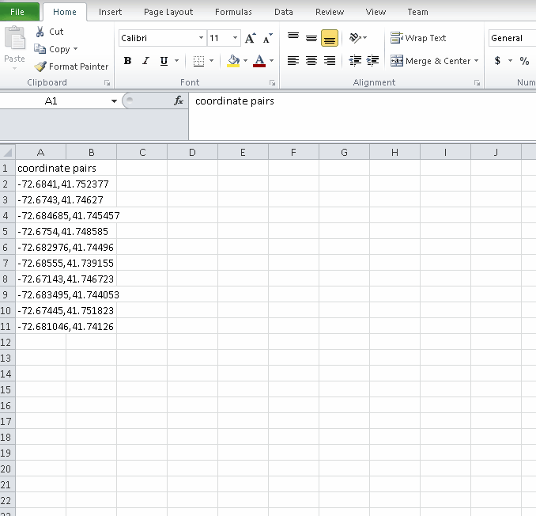

# Clean Messy Data with Spreadsheet Tools
*By [Jack Dougherty](../../introduction/who.md), last updated April 16, 2016*

**TO DO** reorganize this to feature Google Sheets whenever possible, or Excel Online if needed

Sometimes we receive a spreadsheet with problematic data that needs to be cleaned up before we can successfully upload it into a visualization tool.

## Find and Replace with a blank

A common problem with census data is that geographic names contain unnecessary words. For example, when downloading Connecticut county subdivisions (towns), each row appears as:
- Andover town
- Ansonia town
- Ashford town

Our goal is to remove the word "town" from each row, to produce a clean spreadsheet that we can match with other data, like this:
- Andover
- Ansonia
- Ashford

Here's one quick solution: In any spreadsheet tool, use the Find and Replace command to remove unwanted characters. Try it! Click this link and Save to download to your computer:[find-replace-town-geonames in CSV format](https://www.datavizforall.org/clean/spreadsheets/find-replace-town-geonames.csv). This tutorial shows screens from Excel, but other tools are very similar.

1. Open the Find and Replace command.

2. In the Find field, type " town", leaving a space before the word, since we wish to remove only that word when by itself. (Otherwise, we would accidentally remove the "town" in Newtown.)

3. In the Replace field, leave it blank, to represent a blank space.

4. Press the Replace All button. Since this sample file lists 169 towns, the screen will states that 169 instances of "town" have been replaced.

## Split one column into two with Excel

One common problem is when multiple pieces of data appear in one column, and your goal is to split them into separate columns. If those data pieces are separated by commas (or similar punctuation), you might be able to fix this with a simple spreadsheet command: split text into columns.

Try it! Click this link and Save to download to your computer: [split-coordinate-pairs in CSV format](https://www.datavizforall.org/clean/spreadsheets/split-coordinate-pairs.csv), and open with Excel. (**TO DO** test with other spreadsheet tools)

1. Select the data column you wish to split.

2. Select Data > Split Text to Column

3. In the wizard screen, select Delimited data and click next.

4. In step 2 of the wizard screen, check the "comma" box, since this symbol divides the data column. Click next.

5. In step 3 of the wizard screen, accept the default General format, and Finish.

The coordinate pairs column is now split into two separate columns. Relabel the headers: longitude and latitude.

Animated example from Excel for Windows (thanks @f3mlat):

**TO DO** write directions to split a single address cell "300 Summit St, Hartford CT 06106" into separate columns for address, city, state, zip

## Combine separate data columns into one

Another common data cleaning problem is when you receive address data in separate columns, like this:

| Street      | City        | State      | Zip        |
| :---------- | :---------- | :--------- | :--------- |
| 100 Main St | Hartford    | CT         | 06106      |

But your data visualization tool requires you to combine all of this terms into one location column, like this:

| Location                          |
| :-------------------------------- |
| 100 Main St, Hartford, CT 06106   |

One easy solution is to write a simple spreadsheet formula to combine (or concatenate) terms, using ampersands (&) as connectors, and quotation marks around blank spaces as separators. For example, if a spreadsheet contained four columns, *Address, City, State Zip* (A-D), then in column E insert a new header named *Location* and a formula in this format:

- =A2 &" " & B2 &" " &C2 &" " &D2

**TO DO**
- Confirm that Google Fusion Tables geocoder does not require commas between terms
- Clarify what happens with zip code in the example above

## Convert Connecticut town names with CTNamecleaner

In Connecticut, residents often list their village or neighborhood names in their address, but these do not necessarily match the official list of 169 Connecticut town governments (called county subdivisions by the US Census). For example, the Elmwood neighborhood is located in the town of West Hartford, and the Rockville village is located in the town of Vernon.

To solve this problem, the data experts at TrendCT/CT Mirror have openly shared a wonderful tool to convert village/neighborhood names into official towns, called CTNamecleaner.

1. Open CTNamecleaner with your browser at http://shiny.trendct.org/ctnamecleaner/
2. Upload a CSV generic spreadsheet. Learn more [about CSV format](../csv/) in this book.
3. Select the data column to be converted into town names, and download the results.

Learn more about [CTNamecleaner on GitHub](https://github.com/trendct/ctnamecleaner), and view the [underlying list of Connecticut place names in a public Google sheet](https://docs.google.com/spreadsheets/d/1WqZIGk2AkHXKYvd4uXy5a2nwyg529e7mMU5610Ale0g/edit#gid=0).



