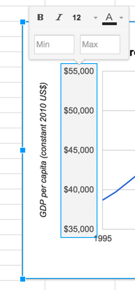

# How to Lie with Charts
*By [Jack Dougherty](../../introduction/who.md), last updated March 25, 2017*

One of the best ways to learn how to detect bias in data visualization is to intentionally manipulate a chart, and tell two (or more) opposing stories with the same data. You’ll learn what to watch out for when viewing other people’s charts, and think more carefully about the ethical issues when you design your own.

This exercise was inspired by Darrell Huff, How to Lie with Statistics (W. W. Norton & Company, 1954), http://books.google.com/books?isbn=0393070875

Right-click this link and Save to download this sample data in CSV format to your computer: [us-gross-domestic-product-per-capita](https://www.datavizforall.org/detect/how-to-lie-with-charts/us-gross-domestic-product-per-capita.csv). This historical data on economic productivity comes from the World Bank, World Development Indicators, http://data.worldbank.org/data-catalog/world-development-indicators

Upload the CSV file to your Google Drive (with Settings to Convert to Google format) to create a Google Sheet.

Select the data cells and Insert > Chart > Line chart, similar to the default version shown below

<iframe width="600" height="371" seamless frameborder="0" scrolling="no" src="https://docs.google.com/spreadsheets/d/11yrhgBX16JL3O99EfK6mjiRwA6CGZkfuSGXbXhrBLEQ/pubchart?oid=1711889200&amp;format=interactive"></iframe>

In your Google Sheet chart, double-click the vertical y-axis to edit the Minimum and Maximum values.

Make the line look "flatter" (slower economic growth) by lowering the minimum to $36,000, and increasing the maximum to $100,000, as shown below:

<iframe width="600" height="371" seamless frameborder="0" scrolling="no" src="https://docs.google.com/spreadsheets/d/11yrhgBX16JL3O99EfK6mjiRwA6CGZkfuSGXbXhrBLEQ/pubchart?oid=1294345990&amp;format=interactive"></iframe>

Make the line look like a "sharper increase" (faster economic growth) by increasing the minimum to $38,000, and lowering maximum to $52,000, as shown below:

<iframe width="600" height="371" seamless frameborder="0" scrolling="no" src="https://docs.google.com/spreadsheets/d/11yrhgBX16JL3O99EfK6mjiRwA6CGZkfuSGXbXhrBLEQ/pubchart?oid=534244967&amp;format=interactive"></iframe>

** TO DO -- add conclusion **



