# GitHub: One Tool for (Nearly) Everything

*By [Jack Dougherty](../../introduction/who.md), last updated February 18, 2016*

Sign up for a [free GitHub account](http://github.com), a free multi-purpose tool that allows you to:
- View and fork a copy of open-source code from other users
- Make simple edits to your code directly in the browser
- Share your code and receive or suggest revisions to others
- Host a live version of your web code with GitHub Pages

GitHub is free if you publicly share your work. Private accounts require a subscription.

This chapter shows the basic steps to use GitHub **entirely in your browser**, which works well for new users on nearly any computer (Mac, Windows, Chromebook, etc.) Intermediate users will want to read the next chapter with supplemental tools: GitHub Desktop and Atom editor. Advanced users may prefer to use GitHub command-line instructions, which are beyond the scope of this book.

**TO DO:** REWRITE directions below to point users to GitHub Desktop and Atom Editor for editing on personal computer

Newcomers can host their code on GitHub, and publish to the web using the GitHub Pages feature, by following step-by-step instructions or this [YouTube video screencast](http://youtu.be/ZVejLE8qtOI).

ZVejLE8qtOI

This basic tutorial demonstrates how to work with GitHub entirely through the browser. More advanced GitHub users may download other free tools (such as [GitHub for Mac](https://mac.github.com) or [GitHub for Windows](https://windows.github.com)) or use other methods (such as the terminal command line) to work more efficiently.

1) Inside your free GitHub account, create a new repository (also known as a repo) to host your project's code (such as an index.html file and more).

2) Enter a repository name and description and check the box to automatically add a README file. If desired, select an open-source license (such as MIT), and click the Create Repository button.

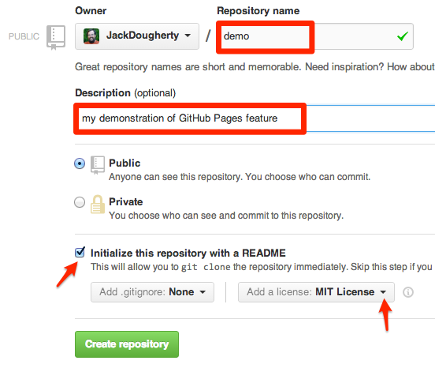

3) Your new repository automatically starts opens the "master" branch. Use the drop-down menu to create a new branch, and name it "gh-pages" (which is short for GitHub Pages), and press enter or return on your keyboard.

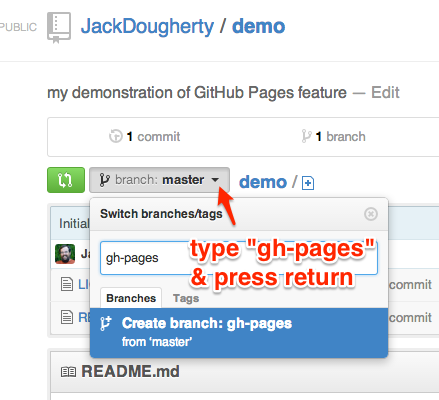

In this tutorial, we do all of our editing and testing work in the gh-pages branch, which automatically appears on the public web. When we're done, we will pull a copy (or sync) our completed work to the master branch for safekeeping and open sharing.

4) To add ONE NEW FILE to the gh-pages branch, click the + button next to the repository name and enter the file name. For example, index.html is the default file name for most web projects.

5) Select the "soft wrap" option (which makes long code strings more readable), and paste code into the editor. In this example, I pasted HTML code that was generated by publishing an interactive chart from a Google Spreadsheet.

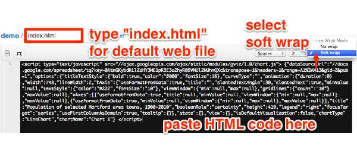

6) At the bottom, select the "commit" button (which means you are making a code change). Optionally, name and describe your commit, if you wish to track changes to your work.

7) Edit an existing file in the gh-pages branch by selecting its title. For example, select the README filename (which should have been automatically generated when you created the repository and the gh-pages branch). On the next screen, select the Edit button.

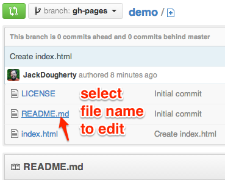

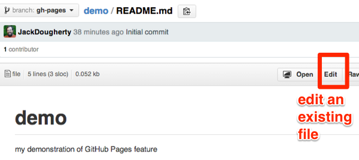

8) When editing the README file, type a link to the live web version of this repository, so that visitors may easily click to view it. The GitHub generic public web address is a combination of your username and ".github.io/" and your repository name, like this: http://USERNAME.github.io/REPOSITORYNAME

In my README file, I typically write it this way so that visitors know to click the link:
View live demonstration site at http://JackDougherty.github.io/demo

Commit your change to the README file in the gh-pages branch by pressing the green button at the bottom of the editor page.

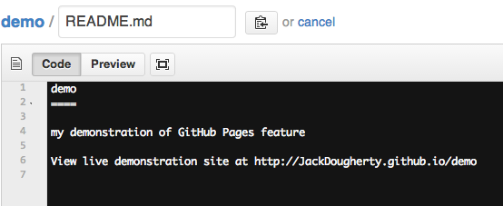

Hint: If you named your file "index.html" then you don't need to add anything else to the web address, because the site will automatically point to this default file. But if you entered a different file name, such as "sample.html", then you need to add it to the web address in this way:  http://Username.github.io/Repositoryname/sample.html

9) Select the repository name to go to the upper-most file in the gh-pages branch.

10) To view your live index.html code on the public web, click the link you created in your README file. (Hint: use the right-click feature to open in a new tab/window). Important: The very first time you create a gh-pages branch, it may take up to 10 minutes for its content to appear on the open web. Afterwards, when you add or edit files in this branch, they should appear nearly instantly on the web, though you may need to refresh your browser to view any changes you have made.

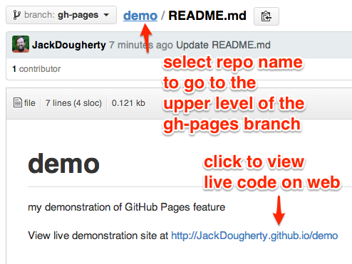

11) To add MULTIPLE FILES to the gh-pages branch, you could copy and paste each one individually as shown above, or choose one of these labor-saving options:

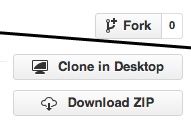

If a code template already exists somewhere on GitHub, "fork" a copy of the repository to your own account, create a gh-pages branch for the live web, and edit/modify the files as desired.

To sync and upload multiple files from your desktop to a GitHub repository, use the free GitHub for Mac or GitHub for Windows tool, which features a graphical user interface to do tasks above very easily.
Advanced coders may use command-line instructions to upload and sync files to GitHub most efficiently.

12) To BACKUP and SHARE your work: After adding or editing files in the gh-pages branch, create a "pull request" (to merge files) to the master branch.

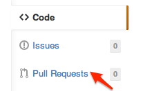

13) Use the drop-down menus to CAREFULLY select the direction of the merge in this TO-FROM format:
TO master branch FROM gh-pages branch

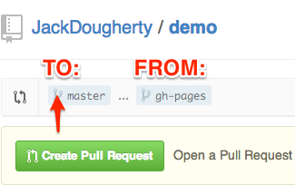

14) Follow these steps to finish the pull request, which merges all content TO the master branch FROM gh-pages branch:

- Create the pull request (select green button)
- Give it a title (such as "updated index and ReadMe")
- Send pull request (green button)
- Merge pull request (another green button)
- Confirm merge (and another green button!)
- Always double-check your repository branch names to do editing and live web testing in the gh-pages branch, then make sync a copy to public share in the master branch.

To embed an interactive data visualization from a GitHub Pages host site into a secondary website (such as an organization's WordPress.org site), see the [Embed iframe with WordPress tutorial in this book](embed/iframe-wordpress/index.html).

See my sample repositories, with links to live demo sites, at https://github.com/JackDougherty?tab=repositories. Learn more about GitHub general features to share and collaborate on other users' public code repositories.

**TO DO**
Reminder: GitHub allows users to create **one fork** of a repo to your account. To create a second copy, go to the repo of your first copy, click Settings, and rename it. But if you rename your repo, you also will need to change any links you created to its live version in the next section.

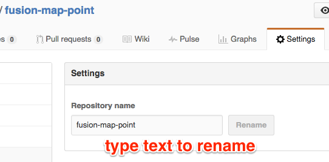

---

[Improve this book:](../../gitbook/improve.md) Select text to insert comments, or suggest edits on GitHub.

[Data Visualization for All](http://datavizforall.org)
is copyrighted by [Jack Dougherty and contributors](../../introduction/who.md)
and distributed under a [Creative Commons Attribution-NonCommercial 4.0 International License](http://creativecommons.org/licenses/by-nc/4.0). You may freely share and modify this content for non-commercial purposes, with a source credit to http://DataVizForAll.org.

