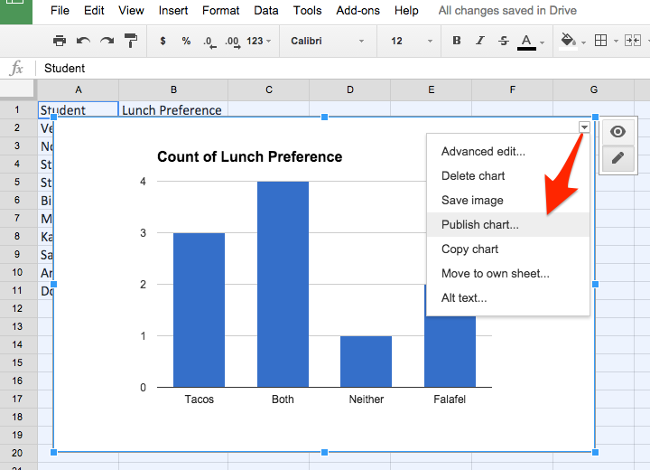

# Embed a Google Sheets interactive chart

The goal is to embed an interactive chart inside your website, so that users can explore the data. This tutorial displays a *very basic chart* to simplify the process, and the end result will appear like the one below. Try it.

<iframe width="600" height="371" seamless frameborder="0" scrolling="no" src="https://docs.google.com/spreadsheets/d/1fwnl5hvkkwz-YDZrogyGnx274BqmozGlIeXyjJ2TKmE/pubchart?oid=462316012&amp;format=interactive"></iframe>

1) In Google Sheets, select the desired data and Insert > Chart. Select the best type for your interactive chart and add any titles, labels, etc.

2) Click right-corner of the interactive chart and select Publish chart. Click OK on next screen.



3) Select the Embed tab, select the Interactive version of your dataviz, and click the blue Publish button.


4) Copy the iframe embed code that appears, which you will paste and modify to match your website.


5) To embed the iframe in a WordPress.org site, the iframe plugin must be installed, as explained in the [Embed with iframe on WordPress.org](embed/iframe-wordpress) chapter.

6) Log into your Wordpress.org site and create a new post. In the editor window, switch from the Visual to the Text tab, which allows users to modify the code behind your post. Paste the iframe code from your interactive dataviz.


7) Initially, the code you pasted includes HTML iframe tags at the front (<iframe...) and the end (...></iframe>), which looks like this:

```javascript
<iframe width="600" height="371" seamless frameborder="0" scrolling="no" src="https://docs.google.com/spreadsheets/d/1fwnl5hvkkwz-YDZrogyGnx274BqmozGlIeXyjJ2TKmE/pubchart?oid=462316012&amp;format=interactive"></iframe>
```

8) Modify the front end of the iframe code by replacing the less-than symbol ( < ) with a square opening bracket ( [ ). Modify the back end by erasing the greater-than symbol ( > ) and the end tag ( </iframe> ). Replace the back end with a square closing bracket ( ] ).


Your modified code should look like this:
```
[iframe width="600" height="371" seamless frameborder="0" scrolling="no" src="https://docs.google.com/spreadsheets/d/1fwnl5hvkkwz-YDZrogyGnx274BqmozGlIeXyjJ2TKmE/pubchart?oid=462316012&amp;format=interactive"]
```

9) Click Preview or Publish/View Post to see how it appears on the web.

10) If desired, continue to modify the iframe code to improve the display of your dataviz on your website. For example, the initial code was 600 pixels wide (width="600"). To display the dataviz across the full width of your website, change this part of the code to 100% (width="100%").

---
[Improve this book:](gitbook/improve.md) select text to insert comment, or suggest edits.

[Data Visualization for All](http://datavizbook.org)
copyrighted by [Jack Dougherty and contributors](introduction/who.md)
is distributed under a [Creative Commons Attribution-NonCommercial 4.0 International License](http://creativecommons.org/licenses/by-nc/4.0).
You may freely share and modify this content for non-commercial purposes, with a source credit to http://DataVizBook.org.

<a rel="license" href="http://creativecommons.org/licenses/by-nc/4.0/"></a>
