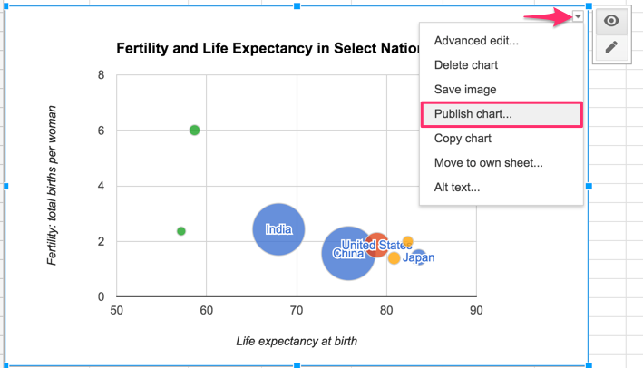
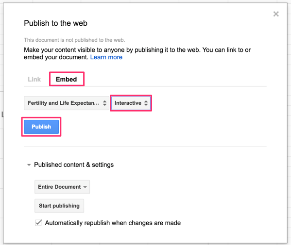
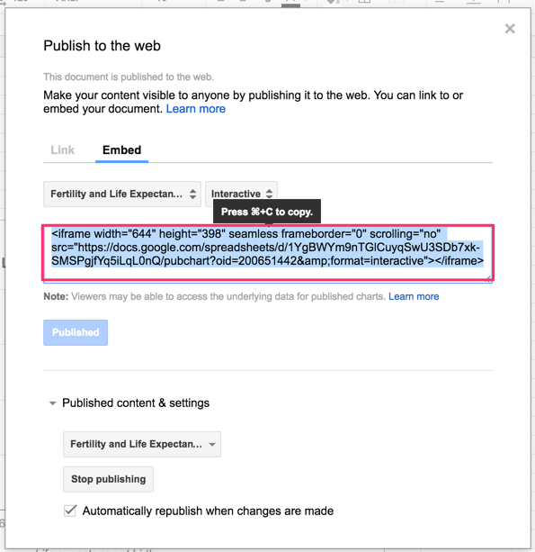

# Copy an iframe code from a Google Sheets interactive chart
*by [Jack Dougherty](../introduction/who.md), last updated March 6, 2017*

Question: After you create an interactive chart or map, how do you embed the live version in a website that you control?

The full answer requires three steps:
- 1) Create a web page that supports iframe codes
- 2) Copy the iframe code from your visualization
- 3) Embed (or paste) the iframe code into your web page

This tutorial focuses on the **second step**, and shows how to publish a Google Sheets interactive chart, and copy its iFrame code. Details may differ for other visualization tools, but the general iframe concept will be similar to most cases. For **steps 1 and 3**, see the [Create a Simple Web Page with GitHub Pages](../github-pages/README.md) tutorial and the [Embed iFrame in GitHub Pages](../iframe-github/) tutorial in this chapter.

## Tutorial

1) Create a Google Sheets chart, which requires a free Google Drive account. Learn more in the [Google Sheets Charts tutorial](../../chart/google-sheets) in this book.

2) Click the drop-down menu in the upper-right corner of the interactive chart and select Publish chart. Click OK on next screen.

3) Select the Embed tab, select the Interactive version, and click the blue Publish button. If you make changes to the chart, they will continue to be published to the web automatically, unless you click the Stop button or checkbox at the bottom.

4) Copy the iframe embed code.

No coding skills are necessary, but it helps to be code-curious. This iframe is a line of HTML code that contains these instructions:
- iframe tags to mark the beginning and end
- width and height: to display your chart in a second site, in pixels
- seamless frameborder: "0" means no border will appear around the chart in the second site
- scrolling: "no" means the chart will not include its own web scrolling feature
- src: the web address (or URL) of the visualization to be displayed in the second site

See the next tutorial in this chapter, [Embed iFrame in GitHub Pages](../iframe-github/), to learn how to paste the iframe into a simple web page. Or see related tutorials in this chapter to embed an iframe in other common web sites.



