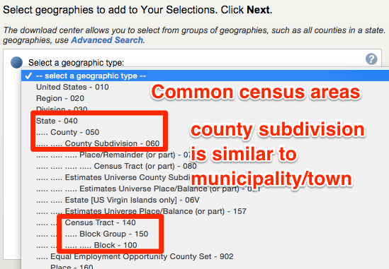

# United States and Census Bureau open data

**The U.S. Census Bureau** (http://census.gov) collects and shares population, housing, and economic data on its open repositories.
- American FactFinder (http://factfinder.census.gov) provides quick facts for a specific location, or links to download more detailed datasets
- The Decennial Census is a full count of the population every ten years, most recently in 2010.
- The American Community Survey (ACS) (https://www.census.gov/programs-surveys/acs/) is annual sample count, which produces:
  - 1-year estimates for areas with populations of 65,000+
  - 3-year estimates for areas with populations of 20,000+
  - 5-year estimates for all census areas

Census areas are geographic divisions in this *general format*:
- State
- County
- County subdivisions (equivalent to Connecticut towns and cities)
- Census tracts (designated areas, roughly 2,500 to 8,000 people)
- Block groups (sub-unit of tract, roughly 600 to 3,000 people)
- Census blocks (sub-unit of block group, but not always a city block)

Common census areas, as shown in [American FactFinder download tool](http://factfinder.census.gov/faces/nav/jsf/pages/download_center.xhtml).

**TO DO** Create interactive map of hierarchical census areas in the Hartford region, with buttons to display colors as panes with z-levels

Learn more: Explore this visual interactive of US Census geographic areas and definitions (http://www.census.gov/geo/reference/webatlas/)

See also in this book: [Find census geography for street addresses with Census Geocoder](../../transform/geocode/index.html)

**Social Explorer** public version (http://socialexplorer.com) is another reputable source for census and related demographic data, past and present. The platform allows users to create data maps that may be exported as static images or presentation slides. Several academic institutions subscribe to the professional version with additional features.  

**TO DO** create tutorial on how to cleanly download census data from Social Explorer and Census.gov to join with geography, especially census tract numbers

**Data.gov** (https://www.data.gov/) is the official open data repository for US federal government agencies, managed by the US General Services Administration, and powered by an open-source CKAN and WordPress platform.

**National Center for Education Statistics (NCES)** (http://nces.ed.gov/) is the primary federal agency for collecting and reporting education data.
- Elementary/Secondary Information System (ELSi) (http://nces.ed.gov/ccd/elsi) - create custom tables and charts from the Common Core of Data (CCD) and Private School Survey

---

[Improve this book:](../../gitbook/improve.md) Select text to insert comments, or suggest edits on GitHub.

[Data Visualization for All](http://datavizforall.org)
is copyrighted by [Jack Dougherty and contributors](../../introduction/who.md)
and distributed under a [Creative Commons Attribution-NonCommercial 4.0 International License](http://creativecommons.org/licenses/by-nc/4.0). You may freely share and modify this content for non-commercial purposes, with a source credit to http://DataVizForAll.org.

