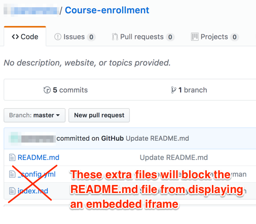
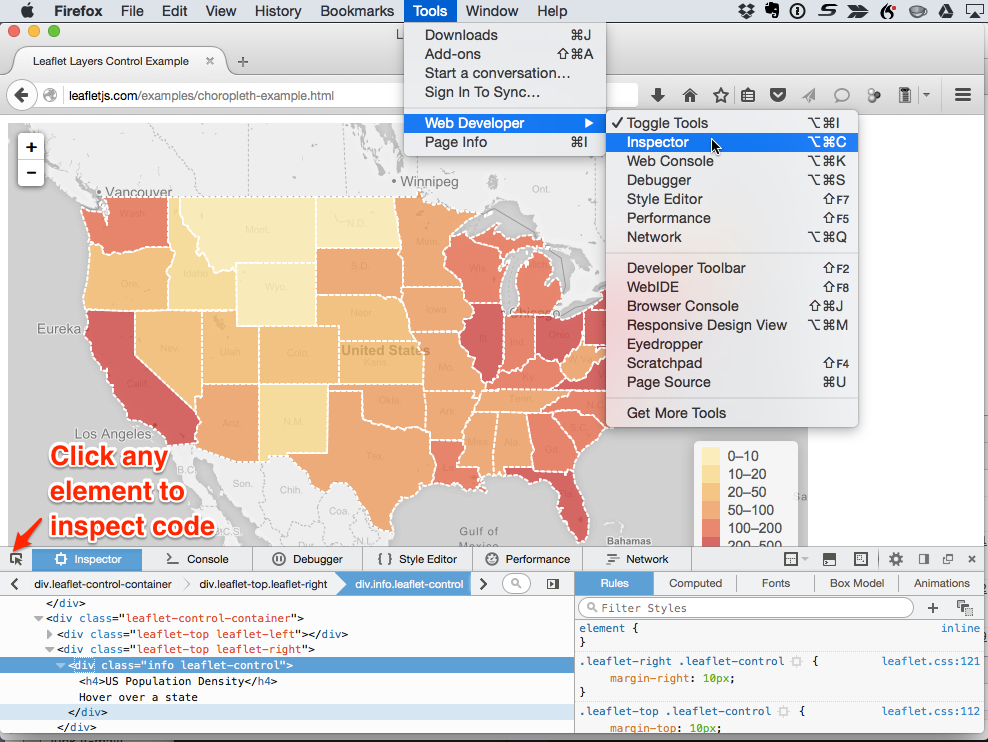

# Fix Common GitHub and Code Errors
*By [Jack Dougherty](../../introduction/who.md), last updated March 16, 2017*

What happens if you cannot view your published GitHub repository, or if your code breaks and no longer displays what it was designed to show? These are common problems, especially for newer students, because accidentally clicking the wrong box or mistakenly erasing a single character (such as a semicolon) can make your visualization seem to vanish, even though your work is usually still there. Breaking your code -- and figuring out how to fix it -- is a great way to learn, even if it requires trial and error.

## About Simple Web Page with GitHub Pages

If you followed the [Create a Simple Web Page with GitHub Pages tutorial](../../embed/github-pages), it should have created two web links (or URLs):
- your code repository, in this format: ```https://github.com/USERNAME/REPOSITORY```
- your published web page, in this format: ```https://USERNAME.github.io/REPOSITORY```

Be sure to insert your GitHub username, and your GitHub repository name, in the general formats above.

These URLs are NOT case-sensitive, which means that ```https://github.com/USERNAME``` and ```https://gitub.com/username``` point to the same location.

#### My simple GitHub web page does not appear
- Make sure that you are pointing to the correct URL for your published web page, in the format shown above.
- Be patient. During busy periods on GitHub, it may take up to 1 minute for new content to appear in your browser.
- Do a "hard refresh" to [bypass any saved content in your browser cache](https://en.wikipedia.org/wiki/Wikipedia:Bypass_your_cache).
  - Ctrl + F5 (most Windows-Linux browsers)
  - Command + Shift + R (Chrome or Firefox for Mac)
  - Shift + Reload button toolbar (Safari for Mac)
- Test the link to your published web page in a different browser. If you normally use Chrome, try Firefox.
- On rare occasions, the GitHub service or GitHub Pages feature may be down. Check https://status.github.com/

#### My simple GitHub web page does not display my iFrame  
- If you followed the [Create a Simple Web Page with GitHub Pages tutorial](../../embed/github-pages) and inserted an iframe in the README.md file, it will appear in your published web page, under these conditions:
  - Ideally, your README.md should be the ONLY file in this GitHub repository
  - Any other files in your repo (such as index.html, default.html, or index.md) will block the iFrame HTML code in your README.md from being published on the web. If you accidentally selected a GitHub Pages Theme, you need to delete any extra files it created: click each file, select trash can to delete it, and commit changes.



#### Save files to computer, delete repo, and start over
If necessary, you can save files to your computer, delete your online GitHub repository, and start over.
- Go to the top-level of your GitHub repository, similar to ```https://github.com/USERNAME/REPOSITORY```
- Click the green "Clone or Download" button, and select Download Zip to receive a compressed folder of your repo contents on your computer.
- In your GitHub repo, click on Settings (upper-right area) and scroll down to Delete This Repository.
- To prevent accidental deletions, GitHub requires you to type in the REPOSITORY name.
- See the [Create a New Repository and Upload Code with GitHub](../create-repo) tutorial in this book to upload the contents of your old repo, if desired.

## Common code template problems and solutions

#### My iFrame does not appear in my web page
- Go back to the [Embed tutorials in this book](../../embed) to double-check the directions
-
- Items listed in your iFrame (such as the URL, width, or height) should be enclosed inside quotes
  - BROKEN iFrame
  ```
  <iframe src="https://jackdougherty.github.io/leaflet-map-simple" width=90% height=350></iframe>
  ```
  - FIXED iFrame
  ```
  <iframe src="https://jackdougherty.github.io/leaflet-map-simple" width="90%"" height="350"></iframe>
  ```


**TO DO**
- Highcharts data sometimes does not update in the web cache. Quit browser and re-open it.


## Browser developer tools

  Peek inside any site and view the web code under the hood with the browser developer tools.

  In Chrome for Mac, go to View > Developer > Developer Tools

  

  In Firefox for Mac, go to Tools > Web Developer > Inspector

  


  
  
