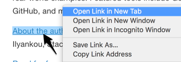

# How to Read and Comment
*by [Jack Dougherty](introduction/who.md), last updated February 28, 2017*

*Data Visualization for All* refers to both this open-access digital book and a [free online course](../enroll) by the same name. We refer to them as "the book" and "the course."

## Recommended: Read the online edition
We designed the book to be read online, in any modern web browser, on desktops, laptops, or mobile devices. The online edition features interactive charts and maps that you can explore, and video tutorials that you can view at your own pace. If desired, readers can freely download any of the ebook editions--[PDF](https://www.gitbook.com/download/pdf/book/jackdougherty/datavizforall) or [ePUB](https://www.gitbook.com/download/epub/book/jackdougherty/datavizforall) or [Mobi/Kindle](https://www.gitbook.com/download/mobi/book/jackdougherty/datavizforall)--but these do not include the interactive features in the online web edition. Learn more about [how GitBook works](../gitbook) and publish your own book.

## Open links in new tabs
Keep your place when reading online and moving between pages.  
- Two-finger trackpad click
- or Control + click (Mac)
- or Alt + click (Chromebook)
- or right-click (Windows and others)

## Use a second monitor
If you have a small screen, consider connecting a second monitor, or work next to a second computer or tablet. This allows you to view tutorials in one screen and build visualizations in the other screen.

## Comment on any paragraph
- Requires a free account on GitHub http://github.com
- Select text and click the plus symbol (+) in margin.
- GitBook section headers and lists cannot accept comments.
- View other comments in the margins, or all in [Discussions](https://www.gitbook.com/book/jackdougherty/datavizforall/discussions).
- Constructive criticism and suggestions are welcome.

## Suggest revisions on any page
- Click "Edit on GitHub" at top of any page, which opens new tab.
    
- To view the code behind the page, click Raw button.
- To suggest revisions, click Editor button (pencil symbol). Requires free [GitHub account](http://github.com).
    
- After entering revisions, scroll down to click Propose File Change.
- On next screen, click Create Pull Request to submit proposed changes to the book owner.
- On next screen, click Create Pull Request again to confirm.
- The book owner will review your suggested revisions, and you will receive automatic notification on any changes.

## Propose additional chapters
- [Contact the lead author](who.md) with a summary of your proposed chapter.
- On the [book GitHub repository](https://github.com/JackDougherty/datavizforall), fork a copy to your own GitHub account (requires free signup).
- Create your proposed chapter following the book's existing folder/file structure, in GitHub/GitBook Markdown format, as described in this chapter [about GitBook](../gitbook).
- If accepted, the contributing author retains the copyright to their work but agrees to publish it under the Creative Commons BY-NC license. Authors do not receive royalties, but enjoy the eternal rewards of sharing knowledge.



