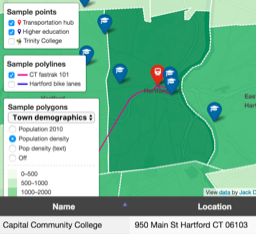

# Leaflet Map Templates
*by [Jack Dougherty](../introduction/who.md), last updated March 21, 2017*

Although beginners will appreciate the drag-and-drop map tools and tutorials described earlier in this book, such as [BatchGeo](../map/batchgeo), [Google My Maps](../map/mymaps) and [Carto](../map/carto), more advanced users often wish to customize their maps, add more complex geometry and interactivity, and control where their work is hosted on the web. A more powerful mapping tool that is relatively easy to learn are code templates based on Leaflet, https://leafletjs.com, an open-source library, which you can [modify and host on GitHub](../github), as described in a previous chapter in this book.

## Tool Review
Pros of working with Leaflet (https://leafletjs.com):
- open-source code, which anyone can freely use online, download, modify, or expand with plugins
- easier for beginners to understand than some other map code libraries
- a compact library (less than 40 KB) that runs on JavaScript in all modern web browsers
- responsive design for mobile and desktop devices, native support for GeoJSON data
Cons:
- must host your own code repositories to publish to the web (with a free service such as GitHub Pages)
- must rely on open-source community of developers to maintain the core code or specific plugins

| Leaflet map templates     | Best use and tutorial chapters |
| --- | --- |
| Leaflet Maps with Google Sheets   | Best to show any combination of points, polygons, polylines, or point table data. Upload your GeoJSON data and modify settings in linked Google Sheet (or CSV) and GitHub repo.  Template with tutorial: [Leaflet Maps with Google Sheets](with-google-sheets) |

** TO DO **
- more template links to come. . .

## Inside Leaflet code templates
The templates featured below vary from simple to complex, but all of them include three basic types of code:
- HTML: to structure content on the web (example: index.html)
- CSS, or Cascading Style Sheet: to shape how content appears on the web (example: style.css)
- JavaScript: to create the map and interactivity  (example: script.js)

Also, these templates refer to other types of code:
- library: link to online instructions to complete routine tasks (examples: Leaflet, jQuery)
- basemap tiles: link to online background map (example: Carto Positron, a light-gray street map)
- data: content to appear on map, typically in CSV or GeoJSON format (examples: data.csv, data.geojson)



