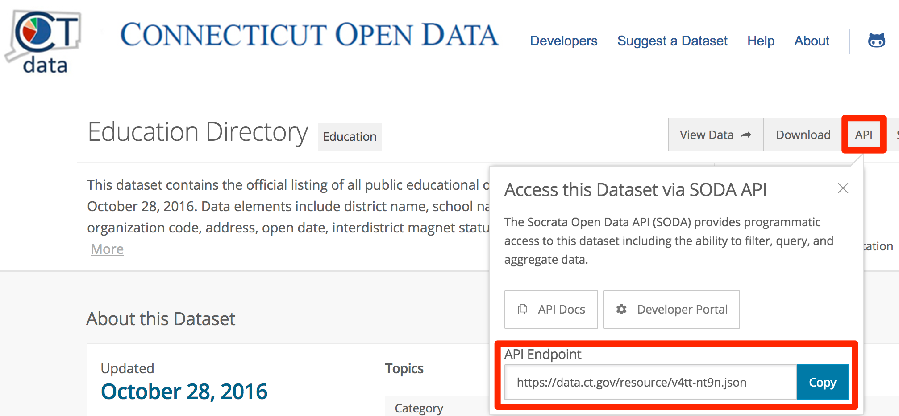

# Pull Open Data into Leaflet Map with APIs
*By [Jack Dougherty](../../introduction/who.md), last updated April 10, 2017*

Up to this point in the book, we’ve built charts and maps using static data that you have downloaded from other sites. But some open data repositories have APIs, or application program interfaces, which means the software that allows computers to communicate with one another. Below is a Leaflet Map template that uses APIs to pull in the most current data from three different open repository platforms: Socrata, Esri ArcGIS Online, and USGS.

## Try it
Explore the map below or [view full-screen version in a new tab](https://jackdougherty.github.io/leaflet-data-apis)

<iframe src="https://jackdougherty.github.io/leaflet-data-apis/" width="90%" height=550></iframe>

## How it works

1) Go to the GitHub repo for the map above: https://github.com/JackDougherty/leaflet-data-apis

2) Explore the code to see how different APIs work. For example, see the first map overlay, which pulls Connecticut School Directory data from the CT Open Data repository on a Socrata open data platform: https://data.ct.gov/resource/v4tt-nt9n

3) Inside the open data repo, look for an API button and copy the endpoint.



4) Paste the endpoint link into your browser, change the suffix from ```.json``` to ```.geojson``` and press return. In order to show the endpoint data as points on a map in this simple Leaflet template, the points must already be geocoded inside the open data repo, and the platform must support a GeoJSON endpoint. In your browser, one sign of success is a long stream of GeoJSON data like this:


5) In this section of the Leaflet map template, the code includes a jQuery function ```$.getJSON``` to call the open data endpoint in GeoJSON format: ```https://data.ct.gov/resource/v4tt-nt9n.geojson```. It also requires a Socrata app token, and you can get your own token for free at: https://dev.socrata.com/register. Each geocoded school in the Socrata data repository is displayed as a blue circle, with data properties (such as: name) in a clickable pop-up.

```javascript
// load open data from Socrata endpoint in GeoJSON format
// with simple marker styling: blue circles
// register your own Socrata app token at https://dev.socrata.com/register
// Connecticut School Directory, CT Open Data, https://data.ct.gov/resource/v4tt-nt9n
$.getJSON("https://data.ct.gov/resource/v4tt-nt9n.geojson?&$$app_token=QVVY3I72SVPbxBYlTM8fA7eet", function (data){
  var geoJsonLayer = L.geoJson(data, {
    pointToLayer: function( feature, latlng) {
      var circle = L.circleMarker(latlng, {
        radius: 6,
        fillColor: "blue",
        color: "blue",
        weight: 2,
        opacity: 1,
        fillOpacity: 0.7
      });
      circle.bindPopup(feature.properties.name + '<br>' + feature.properties.district_name); // replace last term with property data labels to display from GeoJSON file
      return circle;
    }
  }).addTo(map); // display by default
  controlLayers.addOverlay(geoJsonLayer, 'Public Schools (CT Open Data-Socrata)');
});
```

5) Fork a copy of this repo, play with the code, and try to insert GeoJSON endpoints from other open data repositories.



