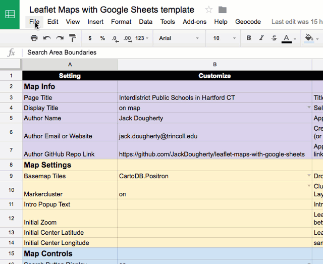
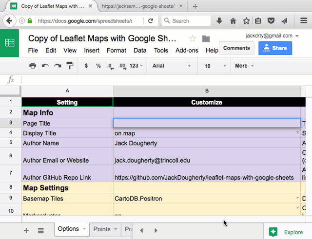

# Leaflet Maps with Google Sheets
*by [Ilya Ilyankou and Jack Dougherty](../../introduction/who.md), last updated March 11, 2017*

** This tool and tutorial are still in-progress **

## Try it

Explore the map or open in a [new tab](https://jackdougherty.github.io/leaflet-maps-with-google-sheets/)

<iframe src="https://jackdougherty.github.io/leaflet-maps-with-google-sheets/" width="90%" height=500></iframe>

The Leaflet map pulls data and options from an easy-to-modify Google Sheet.

<iframe src="https://docs.google.com/spreadsheets/d/1ZxvU8eGyuN9M8GxTU9acKVJv70iC3px_m3EVFsOHN9g/pubhtml?widget=true&amp;headers=false" width="90%" height=300></iframe>

## Tool Review
- [Leaflet Maps with Google Sheets](https://github.com/JackDougherty/leaflet-maps-with-google-sheets) allows you to create and customize point, polygon, or polyline maps with no coding skills. Copy and publish the Google Sheet template, copy and host the pre-made Leaflet code template with GitHub Pages, and easily link the two together.
- Requires a free Google account and a free GitHub account
- ** TO DO ** add more advantages and limitations, currently beta version

## Video with Step-by-Step tutorial

Creating your own version requires four key steps, explained in more detail below.
- A) Fork (copy) the code template and publish your version with GitHub Pages
- B) Make a copy of the Google Sheet template and publish your version
- C) Paste your Google Sheet link into your GitHub code
- D) Modify your Google Sheet options, points, polygons, and polylines

** video to come **


### A) Fork (copy) the code template and publish your version with GitHub Pages

Before you begin, you will need a free GitHub account: http://github.com

1) Right-click to open the Leaflet Maps with Google Sheets code template in a new tab: https://github.com/JackDougherty/leaflet-maps-with-google-sheets

2) In the upper-right corner, sign in to your GitHub account

3) In the upper-right corner, click Fork to copy the repository (repo) into your own account. Important: You can only fork a repository **one time**. To make a second copy, see instructions below **to come**.

4) Click on Settings, scroll down to the GitHub Pages area, select Master, and Save. This publishes the code to a public website you control.

5) Scroll down to GitHub Pages section again, and copy the link to your published web site.


6) Click on the repo name to the go back to the top level.

7) At the top level of your repo, click on README.md, and click the pencil icon to edit this file, written in easy-to-read Markdown code.

8) Erase the link to previous live site, and paste in the link to your site. Scroll down and Commit (save) your edits.

9) Right-click on the link to your published site and open in a new tab. Your website may take up to 1 minute to appear the first time.

### B) Make a copy of the Google Sheet template and publish your version

1) Right-click to open this Google Sheets spreadsheet in a new tab: https://docs.google.com/spreadsheets/d/1ZxvU8eGyuN9M8GxTU9acKVJv70iC3px_m3EVFsOHN9g

2) Sign into your Google account

3) File > Make a Copy of the Google Sheet template to your Google Drive

4) File > Publish your Google Sheet to the public web



### C) Paste your Google Sheet link into your GitHub code

1) Copy your Google Sheet web address (or URL)

2) In your Github code repo, click to open this file: google-doc-url.js

3) Click the pencil symbol to edit the file

4) Paste your Google Sheet URL into the code to replace the current URL

5) Scroll to bottom of page and press Commit to save your changes

### D) Modify your Google Sheet options, points, polygons, and polylines

1) Modify settings in the Options tab in your Google Sheet, then refresh the browser in your published map to view changes



2) In the Points tab of your Google Sheet, paste in new addresses and select 6 columns to geocode

3) Upload polygon and polygon data in GeoJSON format to your GitHub code, and update Polygons and Polylines tabs to match and customize.


**TO DO** Add more details for steps 8 and 9 below, and review all details below to simplify above


- Set map options in a Google Sheet template
-
- upload and geocode addresses, and set map options, in the Google Sheet template
- Create Leaflet maps with a linked Google Sheets template.
- friendly and easy-to-learn searchable map tool with flexibility for advanced users
- clickable point data layers with custom marker icons and pop-up images
- color-coded polygon data layers with numeric or text legends

- host your live web map and polygon data with GitHub Pages
- responsive web design for both small and large devices
- built entirely with open-source code, and no usage limits

## Frequently Asked Questions

- Q: If I already made one fork of a GitHub repo, it will not allow me to make a second fork. But I want to make a second map. How can I do this?
- A: Three options **TO DO: explain in more detail**
  - 1) Go to any of these alternate templates, which contain same code and sheets under a different name
  - 2) Or download any GitHub repo to your desktop, start a new GitHub repo in your account, and manually upload the files
  - 3) Or install GitHub Desktop on your Mac/Windows computer to automate the process described in option 2 above -- see tutorial

## To Do -- CLEAN THIS UP
- explain all steps
- Insert internal references to prior steps in this book. See the Edit and Host Code Templates section in this book. Requires a free GitHub account to host your own version on the web.

Design and host your own map on the public web, add your point and/or polygon data, and customize its appearance. *Quick directions for now -- with illustrations to come soon*

These steps require that you sign up and log into a:
- free GitHub account (https://github.com/) to edit two lines of open-source code
- free Google Drive account (https://drive.google.com) to copy and edit the Google Sheets template

#### A) Fork/copy this code repository and publish with GitHub Pages
- Click the Fork button, in the upper-right corner of this code repository, to create a copy of the code in your account.
- Reminder to fix later: if you have already created a fork of this repo, for your second version you will need to (rename original? clone or download?)
- Your new repository will have a web address in this format:
```
https://github.com/USERNAME/leaflet-maps-with-google-sheets
```
- Click the Settings button, in the upper-right section of your new repository.
- On the Settings page, scroll down to the GitHub Pages section, select Source > master branch, and click Save.
- GitHub Pages has published the *default* map from your code repository as a live public web page, which you can view by clicking on the link displayed after "Your site is published at...". It will appear in this format:
```
https://USERNAME.github.io/leaflet-maps-with-google-sheets/
```
- Copy the link to your live web page above.
- Go back to your GitHub code repository home page.
- Click on the README.md file. To edit this file, click the pencil symbol in the upper-right.
- In the Demo section, paste the link to your live web page from above.
- Scroll down and click the green Commit Changes button, which saves your edits to your GitHub repo.
- Go back to your GitHub repo home page. The new link you pasted to your default map should appear in the lower half of this page. Test it.
- Reminder to fix later: need to remove the dev branch from this public repo to avoid confusing newcomers.

#### B) File > Make a Copy and Publish your Google Sheets template
- Your live web map currently displays data from the *default* Google Sheet template. To insert your own data, you will need to make a copy and edit one line of code in your GitHub repository.
- In your GitHub repo home page, click on the [Google Sheet template link]( https://docs.google.com/spreadsheets/d/1ZxvU8eGyuN9M8GxTU9acKVJv70iC3px_m3EVFsOHN9g/edit#gid=0).
- Make sure that you are logged into your Google Drive account, and select File > Make a Copy. Insert a new name to associate it with your new map data, and save it in a folder where you can find it again later, then click OK.
- In your new Google Sheet, click File > Publish to the Web. (Leave the drop-downs as "Entire Document" and "Web page"). Click Publish. All data that you enter below will be *public*.

#### C) Paste your Google Sheets ID into the GoogleDocID.js file
- In your browser address bar, copy the long ID for your new Google Sheet, appears between "/d/" and "/edit...". It will look similar this:


- In your GitHub repo home page, click on the file named GoogleDocID.js, and click the pencil symbol to edit it.
- Replace the default Google Sheet ID by pasting your own from above. Do not erase the quote marks.
- Scroll down and click the green Commit Changes button to save your edits.

#### D) Customize your map settings in the Options tab

#### E) Geocode address data and customize markers in the Points tab

#### F) Upload/link polygon data and set legend colors in Options tab

- Go back to your live web map, which now displays data from your new Google Sheet. Keep both open in separate browser tabs or windows. When you make changes to your Google Sheet, click the refresh button in the live map to update the display.
- The Google Sheet contains three tabs (labeled at the bottom): Options, Points, Polygons.
- In the Options tab, type in your map title, use drop-downs to select map background, and so forth.
- In the Points tab, each row represents a point on your map. Type or paste in data, image links, addresses, and so forth.
  - To geocode addresses inside this Google Sheet, select the Address-Latitude-Longtiude columns, and click the Geocode > Selected Cells (Address to Lat Long) menu. (Geocoding is an add-on feature that does not appear in default Google Sheets.)
  - Group related points into Categories that you can define, which will appear as layers on the map.
- In the Polygons tab... TO DO: explain how polygon data must be prepared in GeoJSON format and uploaded into your GitHub repo (see example: ct-towns-density.geojson); refer to http://DataVizForAll.org tutorials on how to prepare your polygon data
  - find polygon data
  - refer to tutorial on how GeoJSON data is organized by "properties" -- refer to book and include this exercise: Open your GeoJSON polygon map file with http://geojson.io or http://mapshaper.org to view property categories (such as "name") and values for each item
  - if needed, convert polygon data from shapefile or KML format into GeoJSON format with http://geojson.io
  - if needed, edit polygon data and join/merge tables of new data with http://mapshaper.org



