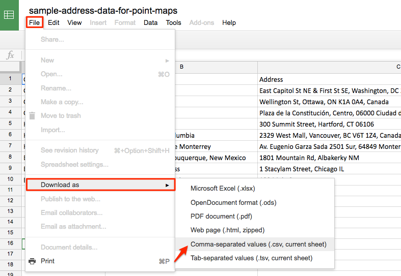

# Map Your Data

*TO DO*: expand on this

This section features free and easy-to-learn mapping tools that you control inside your browser, with friendly drag-drop-click instructions. No coding required.

The most common maps that can be made with these tools are:
- point maps (describe)
- polygon maps (describe)
- others. . .

If you need data or geography to create your map, go to the Find Open Data section (link it) or the Shape Your Map Data section (link it) in this book.

If you need more flexible and customizable mapping tools, go to the Modify Code Templates section (link it) in this book.

## Exercise: Compare Three Tools to Create a Geocoded Point Map
A) Try three drop-and-drag tools to transform address data into a simple interactive point map. Each tool can geocode address data by searching its location in a large database, deciding on the best match, and converting to latitude and longitude coordinates.

| Tool | Link	| Step-by-Step Tutorial |
| ---  | ---- | ---- |
|BatchGeo	| http://batchgeo.com	| https://www.datavizforall.org/map/batchgeo/ |
|Google My Maps |	http://google.com/mymaps | https://www.datavizforall.org/map/mymaps/ |
| Carto Builder	| http://carto.com | https://www.datavizforall.org/map/carto/ |

B) Build your maps using this sample address data, which includes 9 locations in North America, with 3 intentional mistakes to test for geocoding errors. Click the link to view the Google Sheet in your browser, and download into CSV (comma-separated values), a generic table format that can be uploaded into most data visualization tools.

[sample-address-data-for-point-maps](https://docs.google.com/spreadsheets/d/1uFUwnbg57nPoWXN7iEibiigle25FrcGwBKZfehPHdTs/)
- Click the link above to view the Google Sheet in your browser
- File > Download As > Comma-separated values (CSV) to save to your computer

C) After you have created three point maps, compare each tool on these selected criteria:
- Easy-to-learn: Which tool was the simplest for creating a basic point map?
- Price: Which of these free tools provided the most services at no cost?
- Customization: Which tool enabled you to modify the most details about your map?
- Data Migration: Which tool most easily allowed you to import and export your data?
- Error-friendly: Which tool geocoded most accurately or signaled possible errors?
