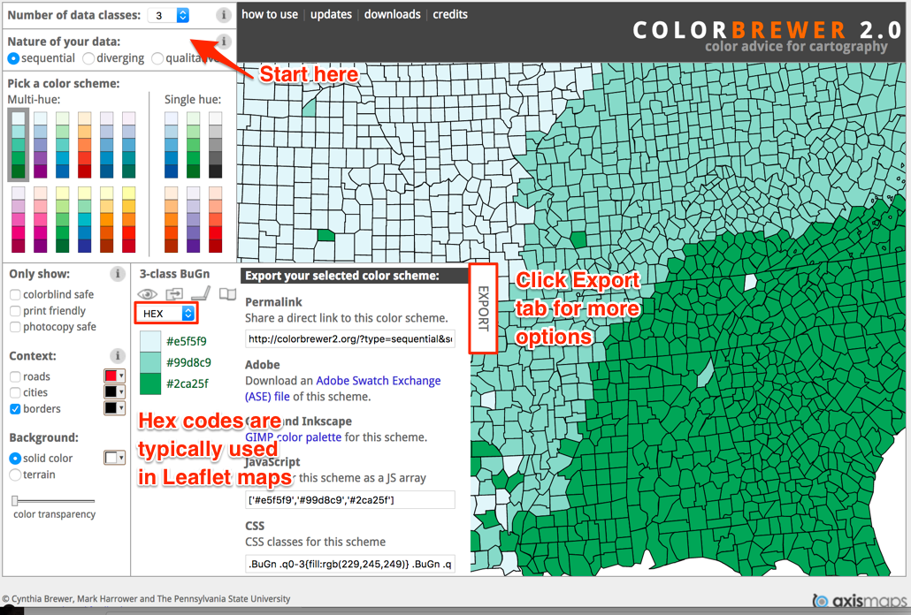

# Map Design Principles
*by [Jack Dougherty](../../introduction/who.md), last updated March 21, 2017*

## Ask Before You Map
Before you leap into a mapping project, consider these questions:

A) Does your data contain geographic information? Common examples:
- Specific locations or addresses (examples: Trinity College, or 300 Summit St, Hartford, CT)
- Latitude and longitude coordinates (example: 41.756, -72.675)
- Regions that are legally recognized (such as nations, states, counties, census tracts) or that correspond to a boundary map in your possession (such as designated neighborhoods or health districts)

While there are many more types of geographic information, these examples above are the most common. If your data lacks geographic information, or if you do not possess the corresponding boundary information, it may not be possible to map it.

B) Does location really matter to your data story?
Sometimes a well-designed chart, rather than a map, may be the best way to visualize your data story. Consider these alternatives:
- to show change over time across different locations, consider a line chart **insert population change line chart**
- to show the relationship between two or more datasets across different locations, consider an XY scatter chart or bubble chart **insert income and test score scatter chart **

C) If a map is the best way to tell your data story, then choose an appropriate type. See [table of basic map types](map) in this book.

** TO DO**
- Pull in relevant principles from the [Chart Design](../chart/design) chapter in this book
- Add more map-specific design principles, such as choosing among basemaps to highlight your story

## Design polygon maps with ColorBrewer
One of the most useful tools for creating meaningful polygon (or choropleth) maps is ColorBrewer, http://colorbrewer2.org, created by Cynthia Brewer, Mark Harrower and the Pennsylvania State University.

1) Number of data classes (or "dividers" or "buckets"). More does not necessarily mean better. Try different numbers and color schemes, and decide if you (and your audience) can easily distinguish between them.
- a smaller number sorts your data into fewer buckets, and shows a more **coarse map**, but differences in colored ranges become **more visible**
- a larger number sorts your data into more buckets, and shows a more **granular map**, but differences in colored ranges become **less visible**

** add screenshot**

2) Nature of data:
- Sequential: best to show steps from lower values (light color) to higher values (dark color)
  - example: a scale that increases from 1 to 100
- Diverging: best to show extremes (dark colors) around a neutral middle (light color)
  - example: a scale that highlights extremes from -100 to 0 to 100
- Qualitative: best to show different categories, represented by their own color
  - example: a map legend of the dominant crop in each area: apples, oranges, bananas

** add screenshot **

3) Pick a color scheme, with options for colorblind-safe and print-friendly.
- Think about the ideal format for your audiences. Are readers more likely to view your visualization on a computer screen, or in print, or both?

4) Click the Export tab to view all options. Some Leaflet map templates in this book use specific color names (such as "red" or "darkgreen") and some use hexadecimal codes, abbreviated as "hex codes" (such as #ff0000 or #336600). To learn more, use a Color Picker tool, such as https://www.w3schools.com/colors/colors_picker.asp

Beware that polygon map design choices about data classes and colors reflect the biases of the author and the software. Read the [Detect Bias in Data Stories](../detect) chapter in this book, especially [How to Lie with Maps](../detect/how-to-lie-with-maps)

## Learn more
- Lisa Charlotte Rost, “Your Friendly Guide to Colors in Data Visualisation,” Lisa Charlotte Rost, April 22, 2016, https://lisacharlotterost.github.io/2016/04/22/Colors-for-DataVis/.



