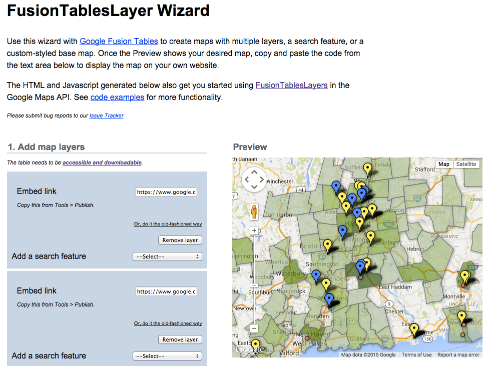

# Overlay Maps with Fusion Tables Layer Wizard

*by [Jack Dougherty](introduction/contact.md), last updated May 2015*

One reason to create maps with Google Fusion Tables is the ability to overlay them on top of one another to view patterns in your data. A simple tool to overlay maps is the [Fusion Tables Layer Wizard](http://fusion-tables-api-samples.googlecode.com/svn/trunk/FusionTablesLayerWizard/src/index.html).

*Static screenshot of the tool*

Follow these instructions:

- For each Google Fusion Table, change the sharing settings to "public" or "anyone with the link" can view.
- Add map layers one at a time, beginning with the bottom layer (in this example, a colored polygon map).
- For each map, copy and paste the link found at Tools > Publish > Send a link.
- Click the *Add Layer* button to insert another. Optional: add a search feature.
- Center and zoom into the preview map as you desire it to be displayed.
- Adjust map dimensions and stylize base map as desired.

Copy and paste the automated HTML code into a web page to display your interactive multi-layered map. (If you need a web publishing solution, see the GitHub Pages tutorial in this book.) Any changes you make to the underlying Google Fusion Tables will appear in the multi-layered map.

[Data Visualization for All](http://datavizbook.org)
by [Jack Dougherty](http://bit.ly/jackdougherty)
and contributors is licensed under a [Creative Commons Attribution-NonCommercial 4.0 International License](http://creativecommons.org/licenses/by-nc/4.0).
You may freely share and modify this content for non-commercial purposes, with a source credit to http://DataVizBook.org.