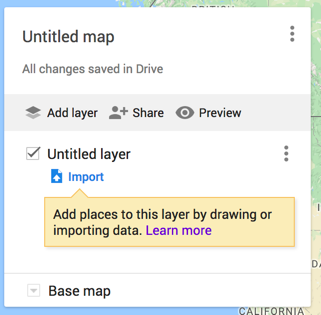
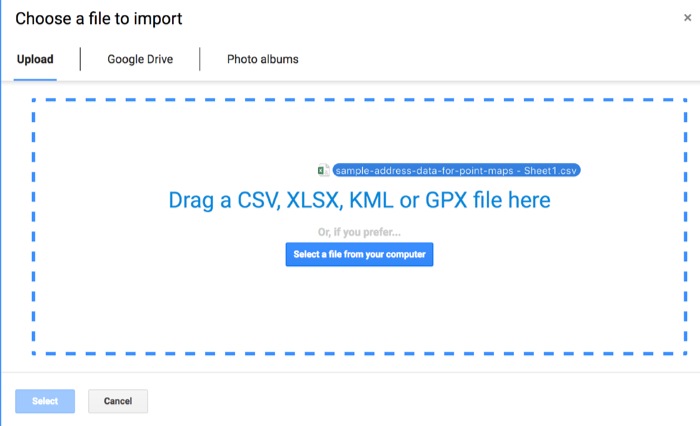
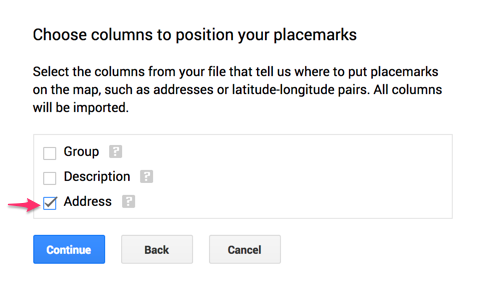
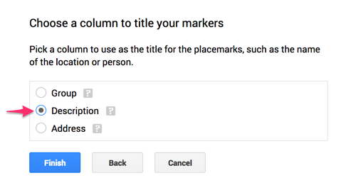
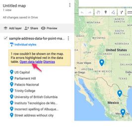
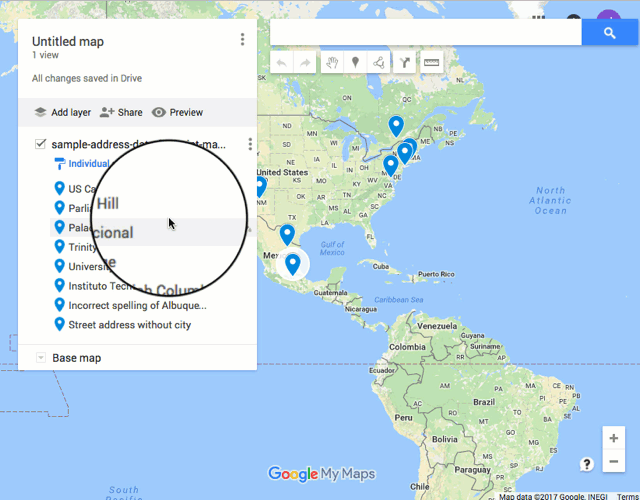
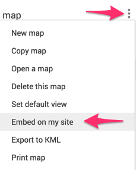

# Point Map with Google My Maps
*By [Stacy Lam and Jack Dougherty](../../introduction/who.md), last updated March 16, 2017*

## Try It
Explore the interactive point map below, or <a href="https://drive.google.com/open?id=1OPrulm2ISYUb990DJOCoYlt_sWc">view the full-screen version</a>,created with Google My Maps (https://www.google.com/maps/d/).

<iframe src="https://www.google.com/maps/d/u/0/embed?mid=1OPrulm2ISYUb990DJOCoYlt_sWc" width="90%" height="480"></iframe>

## Tool Review
- Pros
  - Easy-to learn free mapping tool to import and style point, polyline, and polygon layers and basemap layers
  - Share and collaborate through the Google Drive platform
  - Geocoding error warning
- Cons
  - Limited options to customize map markers
  - Cannot easily create colored polygon maps from data values
  - Cannot extract geocoded data to migrate to another tool

## Video with Step-by-Step Tutorial
ZVIPn8dJeYM

Let's build a simple point map with sample data, using Google My Maps (https://www.google.com/maps/d/). Requires signing up for a free Google Drive account.

1) Click this link and Save to download to your computer: [sample-address-data in CSV format](https://www.datavizforall.org/map/sample-address-data.csv). CSV means comma-separated values, a generic spreadsheet format that most tools can easily open. For help with downloading, see this [short video tutorial](https://www.youtube.com/watch?v=-04PQldP9HQ).

2) Open and sign in to Google My Maps https://www.google.com/maps/d/

3) Click the red + symbol to create a new map, which will be saved automatically to your Google Drive folder.

4) In the map layers area, click the blue Import link. Drag-and-drop the CSV address data file into the web interface to import it.

5) Choose columns to position your placements. Select "Address" for this sample data, then Continue.

6) Choose a column to title your markers. Select "Description" for this sample data, then Finish.

7) After My Maps uploads and geocodes your sample data, click Open Data Table to inspect the results.

8) To style the map markers, click Individual Styles. In this sample data, you can select Group Places By > Style By > Group. This will color markers according to the three categories.

9) To publish your map on the web, click Share, add a map title, change from Private to Public on the Web, so that anyone can view your map. Click Save and Done.

10) To embed the map on your own website, click the three vertical dots next to the map title for more options, and select Embed On My Site. The tool will generate an iframe code for you to copy. For next steps, go to the [Embed on Your Web](../../embed) chapters in this book.

## Learn more
- Google My Maps Help Page https://support.google.com/mymaps/answer/3024396



