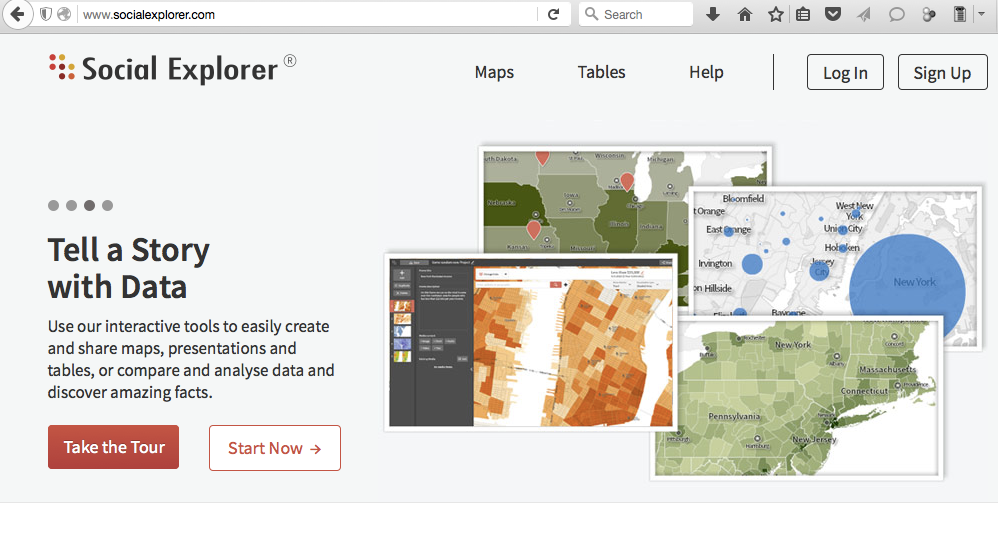
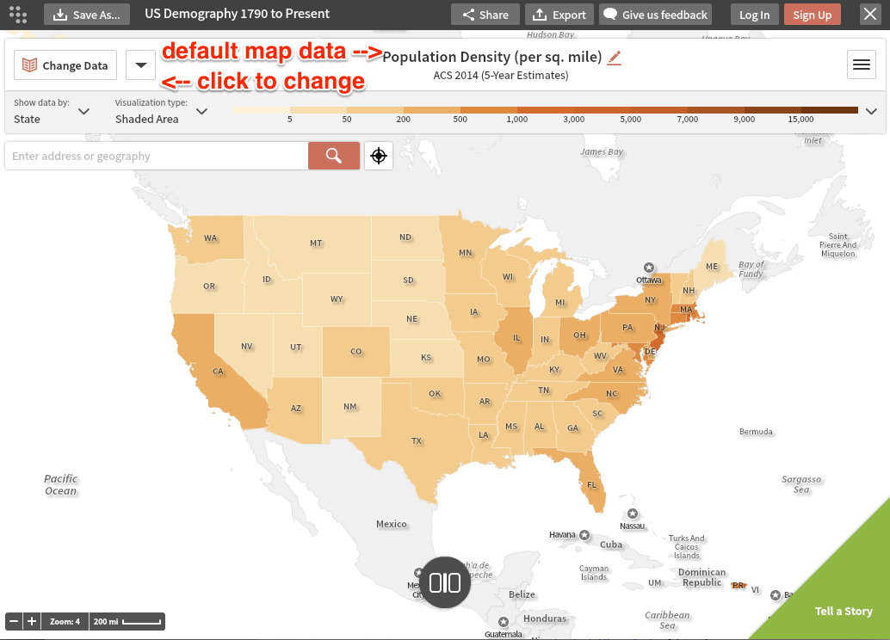
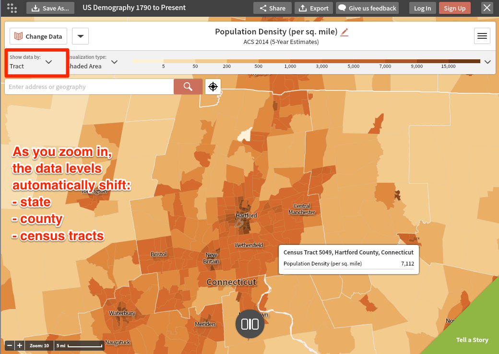
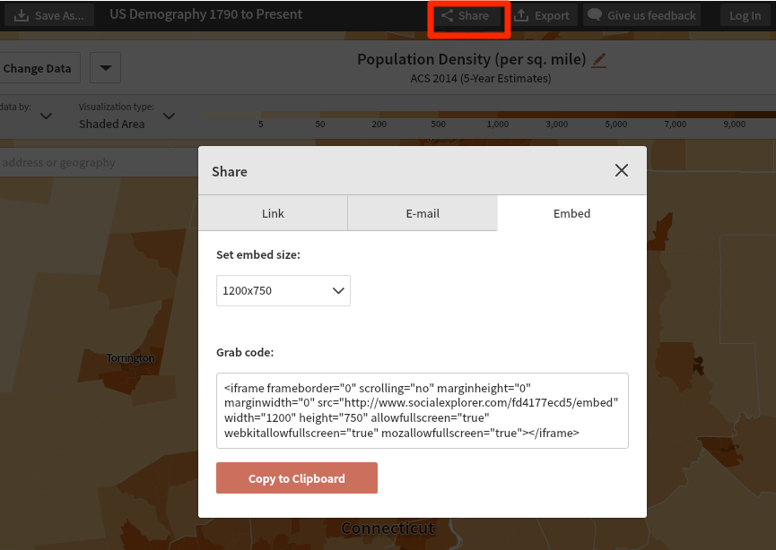

# Create Polygon Maps and Storyboards with Free Social Explorer

*by [Jack Dougherty](../../introduction/who.md), last updated February 2016*

The Social Explorer free edition (http://socialexplorer.com) offers one solution to creating colored polygon maps with US Census demographic data. Explore the embedded sample map below.

<iframe frameborder="0" scrolling="no" marginheight="0" marginwidth="0" src="http://www.socialexplorer.com/0889800f4d/embed" width="640" height="480" allowfullscreen="true" webkitallowfullscreen="true" mozallowfullscreen="true"></iframe>

###Advantages:
- Quick and easy-to-learn
- Free edition includes basic census data
- Export your static maps into presentation slides
- Share link or embed iframe to your interactive map

###Limitations:
- Maps are limited to the demographic data inside the tool.
- Polygon map boundaries are limited to state, county, census tract. The tool does not display municipal data for cities, towns, etc.
- Full census and historical data requires professional subscription.
- Pro subscription available through several academic libraries, but few public libraries.

###Quick overview of features

Start at the Social Explorer website (http://socialexplorer.com) and click on Maps. This tutorial demonstrates features available on the free edition.

The default map view shows US population density, based on the American Community Survey (ACS) 5-year estimates. Click the Change Data button to explore other options.

Geographic boundaries automatically change with the zoom level. As you zoom in, the data levels automatically shift from state, to county, to census tract.

Click the Share button to copy the link to your map, or the iframe code to embed it inside your own website.

Create a free account to save your online map views. Click the Tell a Story button, add a series of interactive map views, and show change over time.

All of the steps above can be done with the free version, but data is limited. Check if an academic library near you has a professional subscription.

---

[Improve this book:](../../gitbook/improve.md) Select text to insert comments, or suggest edits on GitHub.

[Data Visualization for All](http://datavizforall.org)
is copyrighted by [Jack Dougherty and contributors](../../introduction/who.md)
and distributed under a [Creative Commons Attribution-NonCommercial 4.0 International License](http://creativecommons.org/licenses/by-nc/4.0). You may freely share and modify this content for non-commercial purposes, with a source credit to http://DataVizForAll.org.

