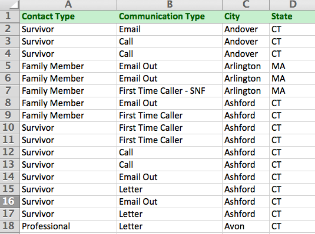

# Aggregate Data Rows with Spreadsheet Pivot Tables

Sometimes your goal is to aggregate individual rows of data into larger groups by the same type. For example, one organization compiled a spreadsheet of its contacts. Each row included a city, and when sorted, it appeared like this:

Most spreadsheet tools include a *pivot table* feature to reorganize and regroup the data. While the buttons and appearances may differ across tools, the concept is the same. Select the entire sheet, turn on pivot tables, and construct a new version of your data by placing variable names in rows, columns, and the value windows. Here's a very simple example:

Learn more about pivot tables for your preferred spreadsheet tool below:

to come: list of pivot tool instructions for each application
