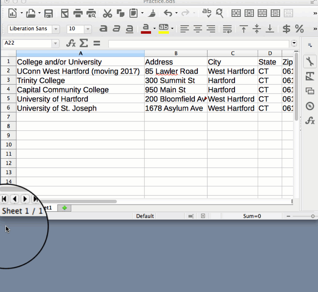
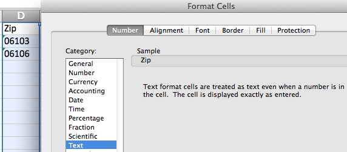

# Spreadsheet formatting

Organize your data into a spreadsheet table with columns and rows (or for more complex projects, a database tool). Three common spreadsheet tools are:

- Microsoft Excel: many people are familiar with this tool, which also has advanced features, but it is not free
- [LibreOffice](http://www.libreoffice.org/): a powerful open-source alternative to Microsoft Office, which anyone can [freely download](http://www.libreoffice.org/download) for Mac/Windows/Linux, with donation requested
- [Google Sheets](https://www.google.com/sheets/about/): free spreadsheet tool on the Google Drive platform, works in modern browsers, requires free account.

All steps illustrated below are nearly the same across these three spreadsheet tools.

## Make clean column headers and sheets

Across the top row, insert short meaningful headers for each column. Avoid special characters that may not be recognized properly by other applications. Make the data in the column consistent within itself.

## Save source data in separate sheet

If you have doubts when cleaning up columns, click (or right-click) on the spreadsheet tab to copy the sheet to another tab as a backup, to avoid destroying any data.

Add a *source* tab, after the data, with notes to remind you and others about its origins and when it was last updated.

## Format data columns as needed

If your data needs to be formatted, select a spreadsheet column by clicking at the top. Or select the entire spreadsheet by clicking the top-left corner icon. Right-click your selection to reformat data (or use menu commands). For example, reformat the data to change the number of decimal points displayed. Or reformat a zip code from a number (because 06106 will not display the first zero) into a text or zip code field.

## Sort data rows

To sort data rows by a column, select the entire spreadsheet (top-left corner icon), then right-click or look for the sort menu. Be sure to select the entire sheet to avoid accidentally sorting one column without the adjacent ones.

