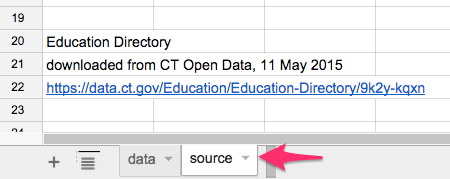

# Prepare Data with Spreadsheet Formats and Formulas

Prepare your data in a spreadsheet (or a database) to make it easier to visualize. If your data does not already exist in a spreadsheet (or table format),

Some people prefer to pay for the Microsoft Excel spreadsheet application due to its familiarity or advanced features. But everything in this tutorial can be achieved with other spreadsheet applications such as LibreOffice (free open-source, donation requested) or Google Sheets (requires a free Google Drive account). All steps below are nearly the same across these common spreadsheet applications.

Across the top row, insert short meaningful headers for each column. Avoid special characters that may not be recognized properly by other applications. Make the data in the column consistent within itself.

If you have doubts when cleaning up columns, click (or right-click) on the spreadsheet tab to copy the sheet to another tab as a backup, to avoid destroying any data.

Add a *source* tab, after the data, with notes to remind you and others about its origins and when it was last updated.

## Format data columns as needed

If your data needs to be formatted, select a spreadsheet column by clicking at the top. Or select the entire spreadsheet by clicking the top-left corner icon. Right-click your selection to reformat data (or use menu commands). For example, reformat the data to change the number of decimal points displayed. Or reformat a zip code from a number (because 06106 will not display the first zero) into a text or zip code field.

## Sort data rows

To sort data rows by a column, select the entire spreadsheet (top-left corner icon), then right-click or look for the sort menu. Be sure to select the entire sheet to avoid accidentally sorting one column without the adjacent ones.

- = Average(A2:C2)

## Copy and Paste or Drag formulas to calculate automatically

Spreadsheets can magically automate calculations across rows or columns. In most cases, you can copy and paste a formula into new cells. Sometimes you can click-and-drag the lower-right corner of a formula cell (which may appear as a cross-hair) to automate calculations.

## Combine address terms to geocode in Google Maps

When preparing address data for a map, some geocoding tools prefer to separate columns (address, city, state, zip) while other tools (such as Google Maps) needs these terms combined into one location column.

To combine (or concatenate) terms, write a simple formula using ampersands (&) as connectors, and quotation marks around blank spaces as separators. No commas are necessary. For example, if a spreadsheet contained four columns, *Address, City, State, Zip* (A-D), then in column E insert a new header named *Location* and a formula in this format:

- =A2 &" " & B2 &" " &C2 &" " &D2

## Copy and Paste > Special > Values to replace formulas with data

After inserting calculations in a spreadsheet, sometimes dynamic formulas must be replaced with static data before the results can be visualized. One solution is to select and copy a column (or the entire sheet), then paste > special > values to replace the formula with numerical results.

Remember that if you need to check or run the calculations again at a later point, click (or right-click) the tab to save a copy to the spreadsheet as a backup.
