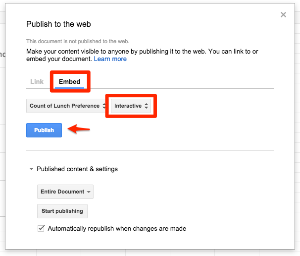
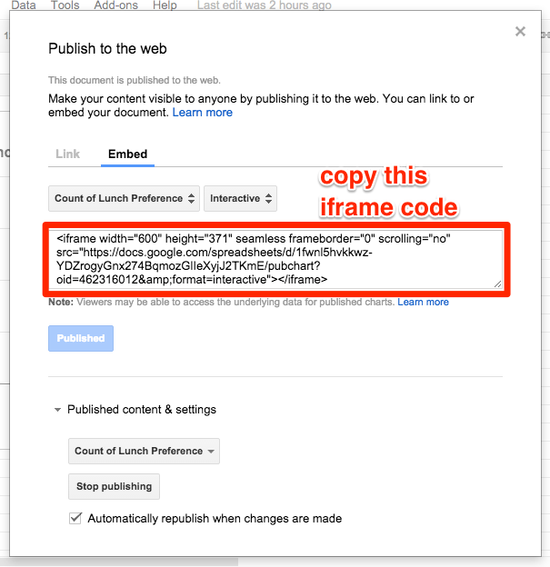
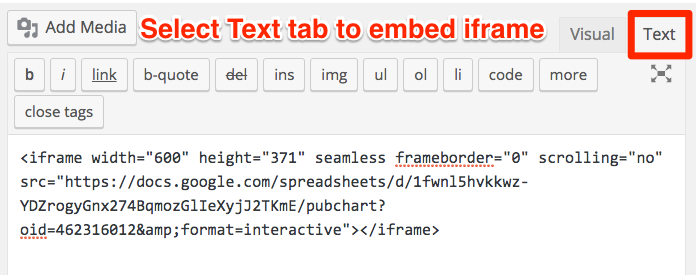
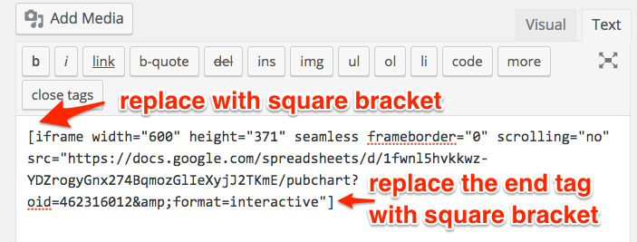

# Embed a Dataviz iFrame in Your Website

When creating data visualizations on a web service, a common goal is to display your interactive chart or map inside a webpage on a different site. For example, if you created an interactive chart in Google Sheets, you could simply **link** to it from an organization's website. Or you could insert a static picture of your visualization, such as a screenshot, on an organization's website. But a better solution is to **embed the live visualization** inside the organization's webpage.

<!--TO DO: bullet and illustrate link vs static vs embed concept above-->

To embed one web page (the data visualization) inside a second web page (the organization's website), we use a simple HTML code known as **iframe**. (Read more about the <a href="http://www.w3schools.com/tags/tag_iframe.asp" target="_blank">ifram</a><a href="http://www.w3schools.com/tags/tag_iframe.asp" target="_blank">e tag at W3Schools</a>.)

The **general iframe concept** works across many data visualization tools and many websites:
- Copy the embed code or URL from your dataviz website
- Paste (and modify) the code as an iframe in your destination website

But details vary, so read and experiment following the examples below.

## Embed a simple Google Sheet chart in a WordPress.org site

The goal is to embed a simple interactive chart inside your website, so that users may engage with the data. The end result will look like this:

<iframe width="600" height="371" seamless frameborder="0" scrolling="no" src="https://docs.google.com/spreadsheets/d/1fwnl5hvkkwz-YDZrogyGnx274BqmozGlIeXyjJ2TKmE/pubchart?oid=462316012&amp;format=interactive"></iframe>

1) In Google Sheets, select the desired data and Insert > Chart. Select the best type for your interactive chart and add any titles, labels, etc.

2) Click right-corner of the interactive chart and select Publish chart. Click OK on next screen.


3) Select the Embed tab, select the Interactive version of your dataviz, and click the blue Publish button.


4) Copy the iframe embed code that appears, which you will paste and modify to match your website.


5) To embed your dataviz in a self-hosted Wordpress.org site, the [iframe plugin] (http://wordpress.org/plugins/iframe/) must be installed and activated. This plugin allows authors to embed iframe codes inside posts/pages, in a modified "shortcode" format surrounded by square brackets. Without the plugin, self-hosted WordPress.org sites will usually "strip out" iframe codes for all users except the site administrator. **I have already installed and activated** the iframe plugin on my site, and the Dashboard view looks like this:


Note that most WordPress.com sites do NOT support an iframe embed code.

6) Go to your WordPress.org site, log in, and create a new post. In the editor window, switch from the Visual to the Text tab, which allows users to modify the code behind your post. Paste the iframe code from your interactive dataviz.


7) Initially, the code you pasted includes HTML iframe tags at the front (<iframe...) and the end (...></iframe>), which looks like this:
```javascript
<iframe width="600" height="371" seamless frameborder="0" scrolling="no" src="https://docs.google.com/spreadsheets/d/1fwnl5hvkkwz-YDZrogyGnx274BqmozGlIeXyjJ2TKmE/pubchart?oid=462316012&amp;format=interactive"></iframe>
```

8) Modify the front end of the iframe code by replacing the less-than symbol (<) with a square opening bracket ([). Modify the back end by erasing the greater-than symbol (>) and the end tag (</iframe>), and inserting a square closing bracket (]).


Your modified code should look like this:
```
[iframe width="600" height="371" seamless frameborder="0" scrolling="no" src="https://docs.google.com/spreadsheets/d/1fwnl5hvkkwz-YDZrogyGnx274BqmozGlIeXyjJ2TKmE/pubchart?oid=462316012&amp;format=interactive"]
```
9) Click Preview or Publish/View Post to see how it appears on the web.

10) If desired, continue to modify the iframe code to improve the display of your dataviz on your website. For example, the initial code was 600 pixels wide (width="600"). To display the dataviz across the full width of your website, change this part of the code to 100% (width="100%").

## NOTE: Other embed examples below need to be updated

If you're hosting your data visualization on a live website (such as <a href="http://epress.trincoll.edu/dataviz/chapter/host-html-github/" target="_blank">GitHub Pages</a>), copy the web address, like this:

<a href="http://epress.trincoll.edu/dataviz/wp-content/uploads/sites/11/2014/02/IframeCopyURL.jpg"></a>

On WordPress.org site with the iframe plugin installed, go to the post/page text editor (not visual editor), then type in a simple iframe shortcode with square brackets, and paste the web address into the "src=" (source equals) section,  like this:

<a href="http://epress.trincoll.edu/dataviz/wp-content/uploads/sites/11/2014/02/iframePasteURL.jpg"></a>

When you preview or publish the WordPress post/page, your interactive data visualization from the first website will appear embedded (or nested) within this secondary website, like the example below:

[iframe src="http://jackdougherty.github.io/tableau-public-sample/"]

If you're using BatchGeo or similar tools, look for "Embed code" and copy it, like this:

<a href="http://epress.trincoll.edu/dataviz/wp-content/uploads/sites/11/2014/02/Embed-BatchGeo.png"></a>

Then paste the BatchGeo iframe embed code  into a WordPress.org post/page, with the iframe plugin installed, and modify it like this:

<a href="http://epress.trincoll.edu/dataviz/wp-content/uploads/sites/11/2014/02/BatchGeoIFrameEmbed.png"></a>

If you're using Google Fusion Tables, modify your Sharing Settings to make your data visualization Public on the Web or to Anyone with the link. Then Publish your data visualization, and modify the width and height to fit the space allowed by the WordPress theme. (For most WordPress.org sites, 600 x 400 pixels looks best.) Copy the long string of code from the "Paste HTML to embed" field, like this:

<a href="http://commons.trincoll.edu/jackdougherty/files/2013/10/GFT_PublishHTML.png"></a>

Then paste your Google Fusion Tables embed iframe code into a WordPress.org post/page, with the iframe plugin installed, and modify the shortcode, like this:

<a href="http://commons.trincoll.edu/jackdougherty/files/2013/10/GFT_iFrameEmbedCode.png"></a>

Preview or publish your page/post, and the dataviz from the first site should appear in your second web page. Learn more about iFrame HTML tags and options to modify them at <a href="http://www.w3schools.com/html/html_iframe.asp" target="_blank">W3 schools</a>.
