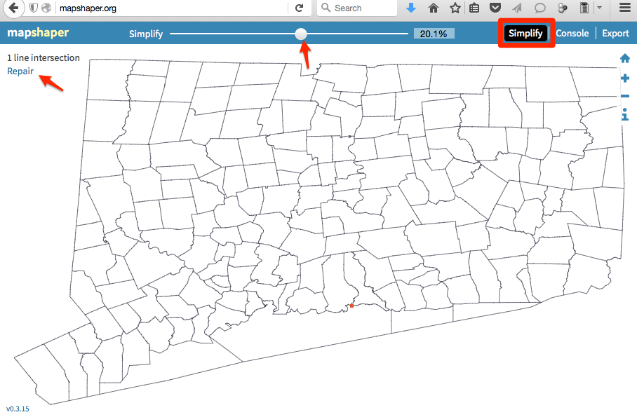
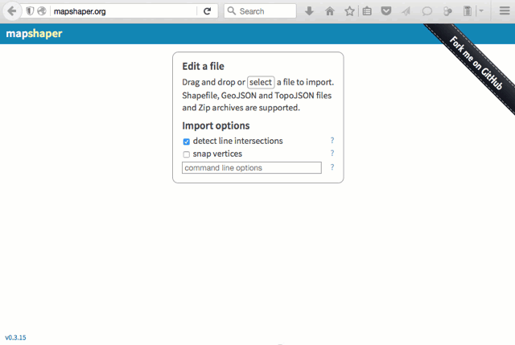
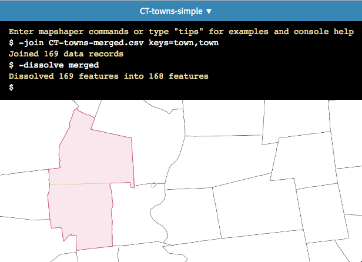

# Convert, Simplify, and Edit Geography with MapShaper.org

MapShaper (http://MapShaper.org) is another versatile open-source mapping tool, developed and maintained by [Matthew Bloch on GitHub](https://github.com/mbloch/mapshaper). Using the web interface, users can:
- import map boundaries in multiple formats: Shapefile, GeoJSON, CSV, and more
- simplify (or smooth out) geographic details to reduce map file size
- edit specific geographic features (dissolve boundaries, etc.)
- export map boundaries the same formats as above

This free and easy-to-learn MapShaper.org web tool has replaced *many* of my map preparation tasks that previously required expensive and hard-to-learn ArcGIS software, or its free but still-challenging-to-learn cousin, QGIS. Even advanced GIS users may find MapShaper.org to be a quick alternative for some, though not all, tasks.

## Import and Convert map boundary files

Drag a map boundary file into the http://MapShaper.org browser window.
- Import GeoJSON (.geojson or .json), TopoJSON, CSV, or Shapefile formats
- For Shapefiles, import the .shp extension; WGS84 projection is most portable

Click the Export button and select Shapefile, GeoJSON, TopoJSON, or CSV


*Hint*: To edit data fields for a few polygons, convert to GeoJSON format, then import into http://GeoJSON.io, as described in the [GeoJSON.io chapter](../geojsonio/README.md) in this book.

## Simplify map boundary geography to reduce file size

Some projects call for a national or statewide map view to be zoomed out, meaning that small geographic details are not visible or unnecessary. In these cases, use the MapShaper.org Simplify command to reduce the file size, so that your interactive web map will load faster for users. The example below began with a detailed map of Connecticut town boundaries (1:100,000 scale) at 2MB, which was reduced (without visibly sacrificing statewide geographic detail) to around 200KB.

Import the map boundary as described above. Click the Simplify button to review options. In this case, I usually accept the default settings. Click Next.

Slide the Simplify button from 100 percent down to an appropriate number for your map zoom level. If important geographic details disappear, you may have gone too far.

Look in the upper-left corner and click on recommended Repairs to your map file.

Complete the process by clicking Simplify once again. Export your file in the preferred format for your project.



## Dissolve a few polygons inside a boundary map

MapShaper.org also includes a Console button to type in commands for common map editing scenarios. Imagine that you need to create regional "clusters" of polygons from a statewide municipal boundary map. In Connecticut, for instance, the towns of Bloomfield and West Hartford have separate municipal government boundaries, but the [CT Department of Public Health](http://www.ct.gov/dph/cwp/view.asp?a=3123&q=397740) has grouped them together into the Bloomfield-West Hartford health district. Your task is to merge their boundaries in the statewide town map, using the "dissolve" command in the MapShaper.org console window. (If you need to dissolve many polygons, see the next section below.)

To follow this example, [download this simplified Connecticut town boundary GeoJSON map file](CT-towns-simplified.geojson)

Import the map into http://MapShaper.org. Click the Information "i" button in the right-hand sidebar, and select any polygon to view the naming structure. In this example, "town" is the column header.

Click the Console button, which opens a window to type in commands. These must be entered precisely, using terms that match your map boundary file. I recommend typing into a plain text file, then copy and paste into the console.

Copy and paste this two-part command into the Console, and press return:

```
-each 'town = "Bloomfield-West Hartford District"' where='town=="Bloomfield" || town=="West Hartford"' \
-dissolve town \
```
How to understand the command above:
- The first part creates a merged town, which consists of two existing towns
- The second line dissolves the boundary between each of those towns
- The pipe symbols (||) separate terms, and are usually located above the return key on US keyboards.
- The backslash symbol ( \ ) separates lines of instructions in this console.



If entered correctly, the command will dissolve only the boundary between two (or more) designated polygons, and the remainder of the map will remain intact. Make additional edits, or close the Console window and Export your file.

## Dissolve multiple polygons more efficiently

To merge multiple polygons in a map, follow this multi-step strategy to save time. Overall, the goal is to export the map data in CSV format, edit this file to insert a list of polygons to be merged, then use Mapshaper to join the original map to the CSV and dissolve selected boundaries.

1. Download the simplified Connecticut town boundary GeoJSON map file](CT-towns-simplified.geojson) and import into http://MapShaper.org.

2. Export in CSV format, which will create table of data about each polygon, without boundaries.

  

3. Open the CSV file with any spreadsheet tool. Copy the contents of the "towns" column, paste it into a second column, and change the header of this second column to "merge-towns".

4. In this new "merge-towns" column, create new group entries for towns you wish to merge together. Leave other towns unchanged.

  

5. Save this new spreadsheet in CSV format with a new file name, such as: CT-towns-merge.csv.

6. Import two files to http://MapShaper.org

  - the CT town boundary GeoJSON map file: CT-towns-simplified.geojson
  - the new CSV file of towns to be merged: CT-towns-merge.csv

7. When importing two or more layers at the same time, use the drop-down menu to display one of them in the viewer. The CSV file will appear as a series of boxes, so display the GeoJSON map file instead.

  

8. Click on the Console button, then copy and paste in this two-part command, and press return:

```
-join CT-towns-merge.csv keys=town,town \
-dissolve merge-towns \
```

  How to understand the command above:
  - The first line "joins" the active layer (the map boundary file) to the CSV spreadsheet, with "keys" to match their shared column: town.
  - The second line dissolves the map boundaries of towns listed in the merge-towns column of the CSV file.

  

9. Click the Console button to close its window, and Export the map in your preferred format.

## Learn more advanced features in MapShaper.org

- See the GitHub project wiki (https://github.com/mbloch/mapshaper/wiki/) for more command references and tips about map simplification


[Improve this book:](../../gitbook/improve.md) Select text to insert comments, or suggest edits on GitHub.

[Data Visualization for All](http://datavizforall.org)
is copyrighted by [Jack Dougherty and contributors](../../introduction/who.md)
and distributed under a [Creative Commons Attribution-NonCommercial 4.0 International License](http://creativecommons.org/licenses/by-nc/4.0). You may freely share and modify this content for non-commercial purposes, with a source credit to http://DataVizForAll.org.


