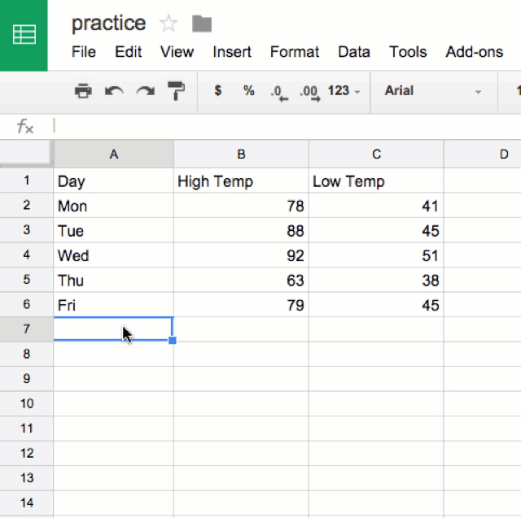
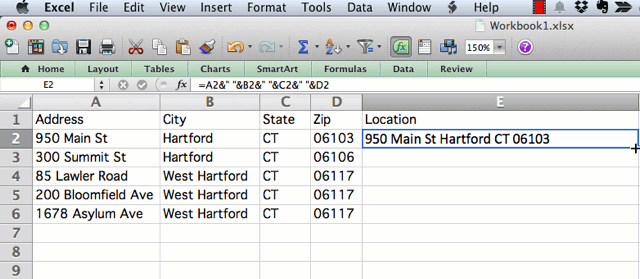
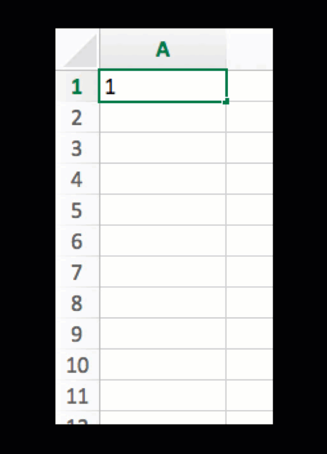

# Calculate with Formulas and Functions

*By [Jack Dougherty](../../introduction/who.md), last updated March 16, 2016*

**TO DO** update this page - see notes inserted below

Simple formulas can save you lots of time. The big advantage of spreadsheet tools is the ability to insert simple formulas to calculate numbers, or combine columns of text, for entire rows and columns.

## Write a simple formula

In most spreadsheets, begin writing a simple formula with an equal sign, and refer to specific cells and functions, such as:

- = A2 + B2 + C2

## Write formulas with built-in functions

**TO DO** rewrite to show how this is same as above

- = Sum(A2:C2)

** TO DO ** rewrite to show common numerical and textual functions

- = Average(A2:C2)

## Copy and paste, or drag formulas

If you've inserted a formula into one row, how can you quickly do the same calculation across all rows?

Spreadsheets can magically automate calculations across rows or columns. In most cases, you can copy and paste a formula into new cells. Sometimes you can click-and-drag the lower-right corner of a formula cell (which may appear as a cross-hair) to automate calculations.

## Copy and Paste > Special > Values to replace formulas with data

After inserting calculations in a spreadsheet, sometimes dynamic formulas must be replaced with static data before the results can be visualized. One solution is to select and copy a column (or the entire sheet), then paste > special > values to replace the formula with numerical results.

Remember that if you need to check or run the calculations again at a later point, click (or right-click) the tab to save a copy to the spreadsheet as a backup.

## Create a column of consecutive numbers

To quickly create a column of consecutive numbers, such as unique ID numbers, in most spreadsheet tools:

- Insert the number 1 into a cell and press Return
- Click the cell and float the cursor over the bottom-right corner, where it will change into a cross-hair symbol
- On a Mac, hold down the Option key and drag the cross-hair down to create consecutive numbers
- **TO DO** insert equivalent commands for Windows, Chromebook



