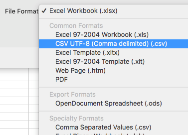

# Save Generic Spreadsheets in CSV Format

*By [Jack Dougherty](../../introduction/who.md), last updated March 16, 2016*

Comma Separated Values (abbreviated as CSV) is a generic spreadsheet format that is very portable across nearly all data and visualization tools. In some cases, a tool may require you to convert spreadsheet data from Microsoft Excel or other applications into generic CSV format.

Note that CSV format will save only the first sheet of a multi-sheet Excel workbook. If you have source information or other data in other tabs, keep your original Excel file for backup purposes. You can give them parallel file names:
- data.csv
- data.xlsx

In Microsoft Excel, select File > Save As, and select CSV format in the drop-down menu.

When saving from Microsoft Excel to CSV, the application will warn you that some Excel features may not be saved in this generic format. Be sure to keep a backup Excel version, and then click Continue to save your data into CSV format.

When you quit Excel, another screen will ask if you wish to save the CSV file a second time. Don't let Excel confuse you. If you have not made any changes to the Excel file since the step above, click Don't Save, because you already saved the file in CSV format.



