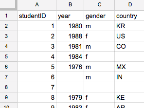
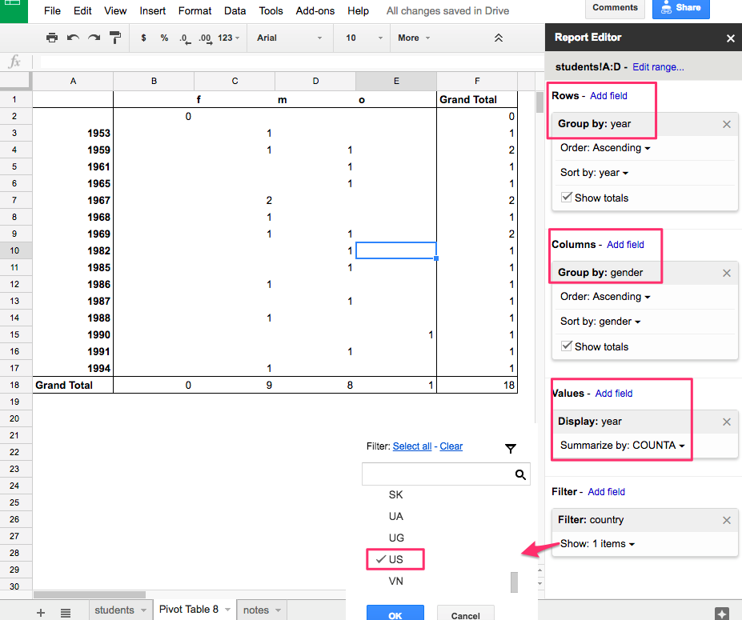

# Group Data with Pivot Tables
*By [Jack Dougherty](../../introduction/who.md), last updated February 10, 2017*

Here's a common problem: You open a large spreadsheet with many rows of data, such as a list of students. Your goal is to count students by categories, such as the number of students by each year of birth.  What's the most efficient way to do this?

Answer: Create a pivot table to aggregate (or group together) and summarize data in another spreadsheet tab.

While pivot tables may look different across spreadsheet tools, the concept is the same.

## Simple Pivot Table with Google Sheets: Tutorial with Video
1. Right-click and Save As this link: [sample-students.csv](sample-students.csv) to download the sample data in a generic spreadsheet format to your computer.
2. Sign into [Google Drive](http://drive.google.com) (requires free account) and drag-and-drop the sample CSV file to instantly upload. Before you do this, make sure your Settings (gear symbol) is set to Convert Uploads to Google Docs editor format (the default setting).
3. Shift-click to select all columns that you wish to pivot.
4. Select Data > Pivot Table..., which opens a new spreadsheet tab.
5. In Report Editor, select Rows > Add Field > Year to list all entries in order.
6. In Report Editor, select Values > Add Field > Year to summarize all values for each entry.
7. Change Summarize by SUM to Summarize by COUNTA (to count alphabetical or numerical entries), or COUNT (to count only numeric values).

3sK7-g0otGM

## More Advanced Pivot Table with Google Sheets

In addition to grouping by rows, you can create more advanced pivot tables by grouping by columns and filtering results. For example, the pivot table shown below shows rows by birth year, columns by gender (blank, female, male, other), and filters results to show only 18 students from one country: US.

## Learn More
- Google, Create and Use Pivot Tables Help Page https://support.google.com/docs/answer/1272898
- Andrew Ba Tran, "Tutorial: How to Make Pivot Tables in Google Sheets," TrendCT, September 4, 2015, http://trendct.org/2015/09/04/tutorial-how-to-make-pivot-tables-in-google-sheets



