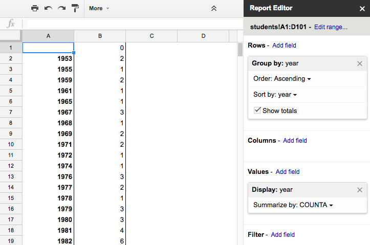

# Group Data with Pivot Tables
*By [Jack Dougherty](../../introduction/who.md), last updated February 10, 2017*

Here's a common problem: You open a large spreadsheet with many rows of data, such as a list of students. Your goal is to count students by categories, such as the number of students by each year of birth.  What's the most efficient way to do this?

Answer: Create a pivot table to aggregate (or group together) and summarize data in another spreadsheet tab.

While pivot tables may look different across spreadsheet tools, the concept is the same.

## Pivot Table with Google Sheets: Tutorial with Video
1. Right-click and Save As this link: [sample-students.csv](sample-students.csv) to download this file to your computer.
2. Sign into [Google Drive](http://drive.google.com) (requires free account) and drag-and-drop the sample CSV file to instantly upload. Before you do this, make sure your Settings (gear symbol) is set to Convert Uploads to Google Docs editor format (the default setting).
3. Shift-click to select all columns that you wish to pivot.
4. Select Data > Pivot Table..., which opens a new spreadsheet tab
5. In Report Editor, select Rows > Add Field > Year to list all entries in order.
6. In Report Editor, select Values > Add Field > Year to summarize all values for each entry.
7. Change Summarize by SUM to Summarize by COUNTA (to count alphabetical or numerical entries), or COUNT (to count only numeric values)

Fc7jYMxM-ng

## Pivot Table with Excel Online: Tutorial with Video
1. Right-click and Save As this link: [sample-students.csv](sample-students.csv) to download this file to your computer.
2. Sign into [Microsoft Excel Online](https://office.live.com/start/Excel.aspx) (requires free account) and click Upload A Workbook in the upper-right corner. To recognize the CSV sample file, switch the Format menu from Custom Files to All Files, then upload.

1. Select the entire sheet (click top-left box)
2. Data > Pivot Tables
3. Choose where to place the pivot table (default is a new sheet)
3. Drag a field name into the Row Labels box (to list all of the different entries under that field).
4. Drag the same field name into Values box (to display the count for each entry).
5. View results of this simple pivot table. To perform any calculations, copy and paste special > values into a new sheet.

** TO DO **
- show more complex pivot table with columns and rows

See more resources on pivot tables with Google Sheets
- Google Help Page https://support.google.com/docs/answer/1272898?hl=en&ref_topic=1258755&rd=1
- Andrew Ba Tran, "Tutorial: How to Make Pivot Tables in Google Sheets," TrendCT, September 4, 2015, http://trendct.org/2015/09/04/tutorial-how-to-make-pivot-tables-in-google-sheets/



