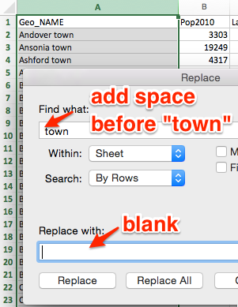

# Clean Up Dirty and Disorganized Data

Sometimes we receive a spreadsheet with problem entries that need to be cleaned up before we can successfully upload it into a visualization tool.

## Find and Replace with a blank

A common problem with census data is that geographic names contain extra words that we wish to remove. For example, when downloading Connecticut county subdivisions (towns), each row appears as: Andover town, Ansonia town, etc.

In any spreadsheet tool, use the Find and Replace command to remove unnecessary words. To follow this example, [download this sample spreadsheet](find-replace-town-geonames.csv). This tutorial shows screens from Excel, but other tools are very similar.

1. Open the Find and Replace command.

2. In the Find field, type " town", leaving a space before the word, since we wish to remove only that word when by itself. (Otherwise, we would accidentally remove the "town" in Newtown.)

3. In the Replace field, leave it blank, to represent a blank space.

4. Press the Replace All button. Since this sample file lists 169 towns, the screen will states that 169 instances of "town" have been replaced.

## Split one column into two with Excel

One common problem is when multiple pieces of data appear in one column, and your goal is to split them into separate columns. If those data pieces are separated by commas (or similar punctuation), you might be able to fix this with a simple spreadsheet command: split text into columns.

To follow this example, [download this sample spreadsheet](split-coordinate-pairs.csv), and open with Excel. (**TO DO** test with other spreadsheet tools)

1. Select the data column you wish to split.

2. Select Data > Split Text to Column

3. In the wizard screen, select Delimited data and click next.

4. In step 2 of the wizard screen, check the "comma" box, since this symbol divides the data column. Click next.

5. In step 3 of the wizard screen, accept the default General format, and Finish.

The coordinate pairs column is now split into two separate columns. Relabel the headers: longitude and latitude.

**TO DO** insert GIF animation above?

## Combine separate data columns into one

Another common data cleaning problem is when you receive address data in separate columns, like this:

| Street      | City        | State      | Zip        |
| :---------- | :---------- | :--------- | :--------- |
| 100 Main St | Hartford    | CT         | 06106      |

But your data visualization tool requires you to combine all of this terms into one location column, like this:

| Location                          |
| :-------------------------------- |
| 100 Main St, Hartford, CT 06106   |

One easy solution is to write a simple spreadsheet formula to combine (or concatenate) terms, using ampersands (&) as connectors, and quotation marks around blank spaces as separators. For example, if a spreadsheet contained four columns, *Address, City, State Zip* (A-D), then in column E insert a new header named *Location* and a formula in this format:

- =A2 &" " & B2 &" " &C2 &" " &D2

**TO DO**
- Confirm that Google Fusion Tables geocoder does not require commas between terms
- Clarify what happens with zip code in the example above

## Clean up Connecticut city/town names with VLOOKUP

In Connecticut, residents often write their local village, post office station, or borough name into the city field of an address. But these local names do not necessarily match up with the official list of 169 Connecticut town municipality names.

The Connecticut Mirror/TrendCT staff have openly shared a wonderful spreadsheet, ctnamecleaner, to help unify these mismatched names.

Click to view [ctnamecleaner in a public Google sheet](https://docs.google.com/spreadsheets/d/1WqZIGk2AkHXKYvd4uXy5a2nwyg529e7mMU5610Ale0g/edit#gid=0). For advanced users, see also https://github.com/trendct/ctnamecleaner

Use the VLOOKUP tool, described in this book, to match up official town names in your data.

**TO DO** illustrate the concept and steps above

## Advanced data cleaning

For more advanced data cleaning, see Alvin Chang's excellent tutorial to Open Refine in TrendCT/CT Mirror:
http://trendct.org/2015/04/24/john-jonathan-and-johnny-how-to-merge-them-in-open-refine/
