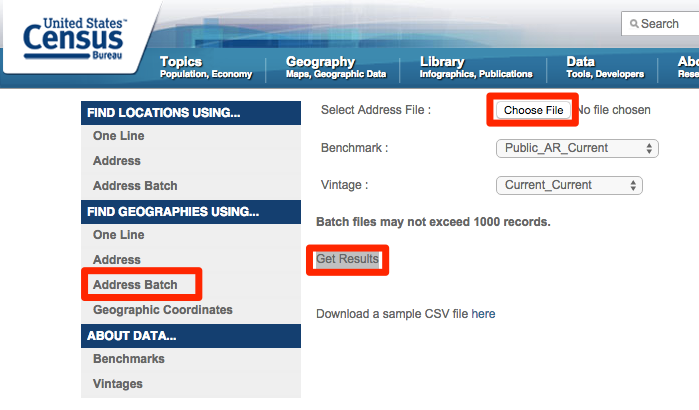

# Geocode address data with US Census Geocoder

Geocoding means to convert the description of a specific place, such as a street address, into a location on a map. When 

Although many free web tools 

**TO DO**
- Introduce this tool: https://www.census.gov/geo/maps-data/data/geocoder.html
- Read the intro and documentation: http://www.census.gov/geo/maps-data/data/geocoder.html
- Refer to vocab in the Find-Census section
- Refer to CSV section

To follow this tutorial, [download 50 sample addresses in CSV format](sample-addresses-50.csv).

Steps:

1. Use a spreadsheet tool to organize your address data into five columns: any ID number, street, city, state, zip code. **Remove all column headers**.

| :---------- | :---------- | :---------- | :--------- | :--------- |
| 1           | 100 Main St | Hartford    | CT         | 06106      |

2. Save the file in CSV format, in batches of no more than 1,0000 rows per file.

3. Go to US Census Geocoder (https://www.census.gov/geo/maps-data/data/geocoder.html) and upload the CSV file.

4. To obtain latitude-longitude coordinates and census areas (tracts and block groups) for multiple addresses, select Find Geographies Using...Address Batch, and click Get Results. Be patient if using the service during busy weekday hours.

  

5. The web browser will download the output in a file named: GeocodeResults.csv. The results do not contain column headers, but see the screenshot below for guidance, or [read the documentation](http://www.census.gov/geo/maps-data/data/geocoder.html).

6. Use a spreadsheet tool to open the CSV file. Sort results by the match quality (columns C and D), with these entries: match exact, match non-exact, tie, no-match.

7. For results without an exact match, clean up the address and try to re-geocode. Or look up individual addresses in another geocoding service, such as Google Maps (https://www.google.com/maps).

**TO DO**
- Explain how to use related tools for common next steps:
- use VLOOKUP function to join census areas (tracts or block groups) to ACS demographic data
- use pivot tables to aggregate locations by census area

---

[Improve this book:](../../gitbook/improve.md) Select text to insert comments, or suggest edits on GitHub.

[Data Visualization for All](http://datavizforall.org)
is copyrighted by [Jack Dougherty and contributors](../../introduction/who.md)
and distributed under a [Creative Commons Attribution-NonCommercial 4.0 International License](http://creativecommons.org/licenses/by-nc/4.0). You may freely share and modify this content for non-commercial purposes, with a source credit to http://DataVizForAll.org.

