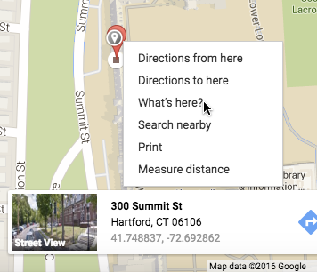
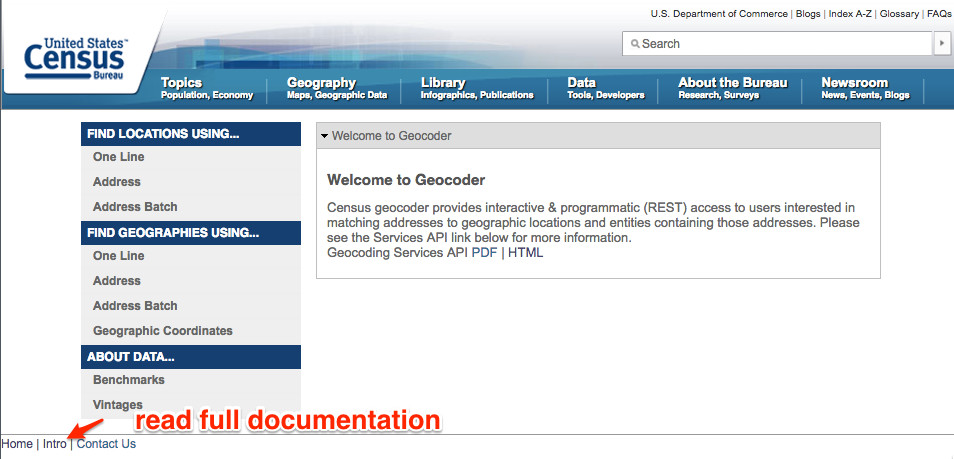

# Geocode Addresses with Google Sheets Scripts
*By [Ilya Ilyankou and Jack Dougherty](../../introduction/who.md), last updated March 27, 2017*

**TO DO**
- problem 1: some high-quality geocoding services are freely available but not easy for beginners to use
- problem 2: many tools geocode addresses into a map, but most do not let you save or extract the coordinates (explain)
- problem 3: some tools geocode addresses into other geographic units, such as US census tracts
- solution: We created two free Geocoder scripts that run inside a Google Sheet template to solve these problems
- https://github.com/JackDougherty/google-sheets-geocoder

** REORGANIZE all content below **

Geocoding means to convert the description of a specific place, such as a street address, into a location on a map. Lots of free web tools geocode addresses for us. When you type my work address "300 Summit St, Hartford, CT 06106" into Google Maps, it displays the location as a red point on a map. Right-click that point, select the "What's Here?" option, and the latitude-longitude coordinates will appear: 41.748, -72.692.

You can easily geocode batches of street addresses with several of the free web tools described in this book, such as BatchGeo and Google Fusion Tables. But most of these tools have limitations:
- they do not show the coordinates for each geocoded point (unless you check each one individually, as shown in the Google Maps example above)
- they do not show the quality level of the geocoded match (meaning whether the computer made an exact match, or found only the general area)

Expensive and harder-to-learn geocoding tools, such as ArcGIS, do show coordinates and match quality, but the setup process can be frustrating and time-consuming.

Fortunately, the **US Census Geocoder** (http://geocoding.geo.census.gov/geocoder/) offers a high-quality, easy-to-learn, free service. In my tests of various free and paid geocoding services, this US Census tool yields the most productive results. Read details in the documentation on its [introduction page](http://www.census.gov/geo/maps-data/data/geocoder.html).

Strengths:
- Upload addresses in a CSV generic spreadsheet
- Batch geocode up to 1,000 addresses at a time
- Results show match quality, the matched address, lat-long coordinates, and census tracts & block groups
- Good quality results, even when addresses include apartment numbers, misspellings

Limitations:
- Inputs and outputs have no column headers, which may confuse novices
- Large batches may be delayed a few minutes during peak time periods
- Unmatched addresses need to be manually corrected and re-submitted

1) Click this link and Save to download this file to your computer: [sample-addresses-50 CSV format](https://www.datavizforall.org/geocode/sample-addresses-50.csv). CSV means comma-separated values, a generic spreadsheet format that most data tools can easily open.

2) Use any spreadsheet tool to organize your address data into five columns: any ID number, street, city, state, zip code. **Remove all column headers**.

  

  *Hints:*
    - If your data lacks ID numbers, quickly [create a column of consecutive numbers](../../transform/calculate/index.html), as shown in this book.
    - If your address data includes apartment numbers, leave them in.
    - Only the ID and address fields are required. City, state, and zip code may be blank if you lack any of this information, but fewer matches will be exact.
    - If your address data is combined into one cell, such as:
      - 300 Summit St, Hartford, CT 06106
      - then try to [clean your data with the split column method](../../transform/clean/index.html) in this book.
    - If you need to temporarily move other non-address data columns into a second spreadsheet, remember to paste the column of ID numbers into the second sheet. After geocoding, sort both sheets by the ID column, then paste to rematch the data.

3) Save the file in CSV generic spreadsheet format, in batches of no more than 1,0000 rows per file. Learn more about [saving in CSV format](../../spreadsheet/csv), in this book.

4) Go to US Census Geocoder (https://www.census.gov/geo/maps-data/data/geocoder.html)

5) Select the Find Geographies Using...Address Batch button for maximum results, including lat-long coordinates and census geography (tracts and block groups). *If census geography is not needed, select Find Locations Using...Address Batch.*

6) Click the Choose button to upload your CSV file. Use the default benchmark and vintage settings for the most current data. Click the Get Results button, and be patient if using the service during busy weekday hours.

  

7) Census Geocoder will download the results through your web browser in a file named: GeocodeResults.csv. Since these results do not contain column headers, use the screenshot below for guidance, or [read the Census Geocoder documentation](http://www.census.gov/geo/maps-data/data/geocoder.html) for more details.

  

8) Use a spreadsheet tool to open the CSV file. Sort results by the match quality (columns C and D), with these entries: match exact, match non-exact, tie, no-match.

9) For results without an exact match, check the address for typos, and try to re-geocode in a separate CSV file. The US Census Geocoder tool is very good, but not perfect. For a few rows of hard-to-match data, use a different geocoding tool, such as the Google Maps > What's Here feature described at the top of this page, to look up individual addresses and coordinates.

## Common next steps in this book:
- Upload geocoded coordinate data into a [Leaflet map template](../../leaflet/index.html).
- Aggregate individual rows of data into groups by census area with [pivot tables](../../spreadsheet/pivot).
- [Download census data](../find) by tract or block group, and use the [VLOOKUP formula](../../spreadsheet/vlookup/) to join or merge this rows of data that you have geocoded by census tract or block group.



