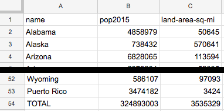

# Normalize Data to Create Meaningful Polygon Maps
*By [Jack Dougherty](../../introduction/who.md), last updated March 31, 2017*

When preparing polygon maps, normalize your data to create more meaningful comparisons.

Learn the difference between:
- **Raw data:** absolute values, such as the population of each US state (example: Connecticut population in 2015 = 3,590,886 people)
- **Normalized data:** represented on a standard scale (also known as standardized data), such as the population density of each US state (example: Connecticut 2015 population density = 3,590,886 people / 4,482 square miles = 742 people per square mile, equivalent to 1,922 people per square kilometer)

The difference between raw versus normalized data matters, especially in polygon maps. For example, the US states of Connecticut and Iowa have similar populations of about 3 million people each. But the rural midwestern state of Iowa has a much larger land area of over 55,000 square miles, while the more urbanized eastern state of Connecticut has a smaller land area of around 4,000 square miles. We can display all of this data in a table (as show below), but when making a polygon map, it makes most sense to show a normalized value, such as population density.

| US State  | Population 2015 | Land Area (in square miles) | Density (pop per square mile) |
| :----- | :----- | :----- | :----- |
| Iowa   |  3,123,899	 | 55,857 | 56 |
| Connecticut | 3,590,886	| 4,842 | 741 |

But raw data still matters, too. Although normalized data allows for easier comparisons across regions of different size, it can hide very low raw data values. For example, imagine two city neighborhoods with equally high unemployment rates of 20%, a normalized value. But if one neighborhood has a labor market population of 5,000 people while the other has only 500, the actual number of unemployed people in the second neighborhood is much smaller, as shown in the table below.

| Neighborhood  | Labor Market Population  | Unemployment Rate | Actual Unemployed People
| :----- | :----- | :----- | :----- |
| First  |  5,000 | 20% | 1,000 |
| Second | 500	| 20%| 100 |

## Different ways to normalize data
After you understand the basic concept, also think about different ways to normalize the same data. Your method depends on the type of data story you wish to emphasize. Look at the table excerpt below on US population and land area by state in 2015:

There are at two acceptable ways to normalize this raw data:
- Normalized by area: Population per square mile in each state (calculate = pop / square miles)
- Normalized by total: Percent of total US population in each state (calculate = state pop / total US pop)

For example:

| US State  | Population 2015 | Land Area (sq. mi) | Density (per square mile) | Percent of total US pop |
| :----- | :----- | :----- | :----- |
| Connecticut | 3,590,886	| 4,842 | 741 | 1.1% |



