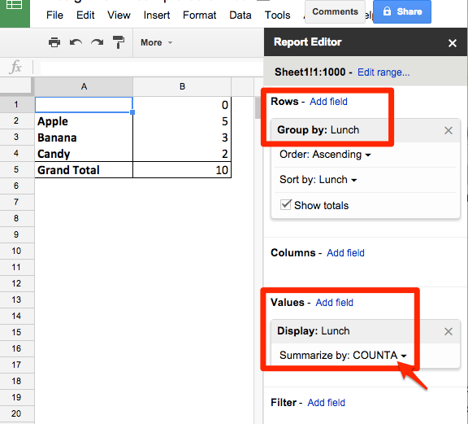

# Aggregate Data with Pivot Tables

Sometimes your goal is to aggregate individual rows of data into larger groups by the same type. For example, one organization compiled a spreadsheet of its contacts. Each row included a city, and when sorted, it appeared like this:

Most spreadsheet tools include a *pivot table* feature to reorganize and regroup the data. While the buttons and appearances may differ across tools, the concept is the same.

### Simple Pivot Table in Excel for Mac
1. Select the entire sheet (click top-left box)
2. Data > Pivot Tables
3. Choose where to place the pivot table (default is a new sheet)
3. Drag a field name into the Row Labels box (to list all of the different entries under that field).
4. Drag the same field name into Values box (to display the count for each entry).
5. View results of this simple pivot table. To perform any calculations, copy and paste special > values into a new sheet.

### Simple Pivot Table in Google Sheets
1. Select the entire sheet (click top-left box)
2. Data > Pivot Tables
3. In Report Editor > Rows > add a field (to list all of the entries)
4. In Report Editor > Values > add same field > summarize by: COUNTA (to display the count for alphabet/textual entries)

---

[Improve this book:](../../gitbook/improve.md) Select text to insert comments, or suggest edits on GitHub.

[The DataViz Book](http://datavizbook.org)
is copyrighted by [Jack Dougherty and contributors](../../introduction/who.md)
and distributed under a [Creative Commons Attribution-NonCommercial 4.0 International License](http://creativecommons.org/licenses/by-nc/4.0). You may freely share and modify this content for non-commercial purposes, with a source credit to http://DataVizBook.org.

