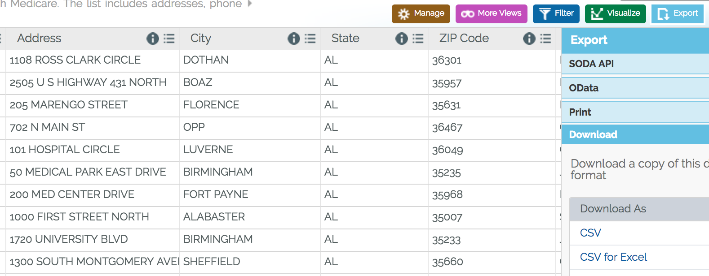
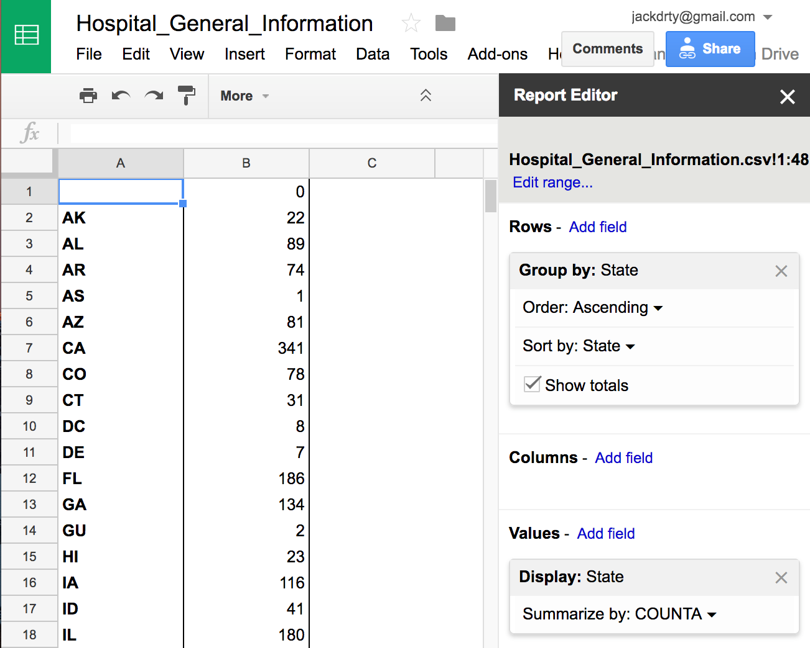

# Pivot Address-Level Point Data into Polygon Data
*By [Jack Dougherty](../../introduction/who.md), last updated March 30, 2017*

Problem: If I begin with address-level point data, how can I transform this into polygon map data?

One solution: In any spreadsheet, split your address data into separate columns (such as Street, City, State), then create a pivot table to aggregate rows into groups (such as the number of addresses in each City or State).

If your location data is combined into one column (example: 300 Summit St, Hartford CT), then see the [Spreadsheets: Split Data Columns tutorial](../../clean/spreadsheets) in the Clean Your Data chapter of this book.

Here's an example using a long list of US hospitals from the Medicare open data repository, which is already split into separate columns: https://data.medicare.gov/Hospital-Compare/Hospital-General-Information/xubh-q36u

1) Open the link above, see columns of data (Address, City, State, etc.), and click the blue Export button to download in the CSV generic spreadsheet format.

2) Open the file with any spreadsheet tool, and create a pivot table to count up the number of hospitals in each state. For help, see the [Pivot Table tutorial in the Spreadsheet chapter](../../spreadsheet/pivot) of this book.

3) Now you can copy and paste the pivot table raw data of hospitals by US states. See the [Normalize Data tutorial](../normalize) and also the [Edit and Join Spreadsheet with Polygon Map using Mapshaper](../mapshaper) tutorial in this book.

## Other Solutions
- use the [Google Sheets Geocoder: US Census Geographies tutorial](../geocode) in this book to convert addresses into census tracts, etc. -- then pivot
- do a polygons-to-points spatial join with Mapshaper.org ** TO DO **
